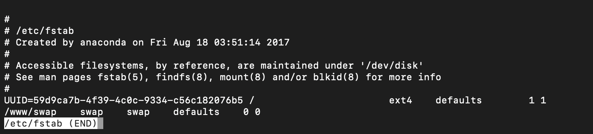

# Linux程序设计作业一

**181250212 朱睿**


1. 用命令完成以下功能 

a) 将当前目录下所有文件备份并压缩成tar.gz，如果成功再将备份拷贝到/backup目录下。 

```shell
tar -zcvf exercise1.tar.gz ./* && cp ./exercise1.tar.gz /backup
```

b) 将上述备份压缩后的文件解压到原来的目录。 

```shell
tar -xzvf exercise1.tar.gz 
```

c) 将当前目录下所有后缀为.html的文件的后缀改为.htm。 

```shell
rename .html .htm *.html
```

d) 将当前目录下所有子目录下以a开头的.cpp文件改名为以b开头的.c文件。 

```shell
find ./ -name "a*.cpp" -exec rename 's#(.*/)a([^/]*).cpp#$1b$2.c#g' {} \;
```


2. 自己查阅Linux相关书籍资料，学习并完成以下作业题： 

a) 请简要叙述DOS/Windows中的文本文件，UNIX/Linux中的文本文件以及Mac中的文本文件有何不同之处，并给出至少一种你认为较为实用的转换方案。(需要两两给出转换方案) 

`DOS/Windows`文本文件的换行符是：`\r\n`

`UNIX/Linux`文本文件的换行符：`\n`

`Mac`中文本文件的换行符：`\r`

1. `DOS/Windows` --> `UNIX/Linux`：

   ```shell
   sed -i 's/\r$//' win.txt
   ```

2. `DOS/Windows` --> `Mac`：

   ```shell
   cat win.txt | tr -d '\n' > mac.txt
   ```

3. `UNIX/Linux` --> `DOS/Windows` ：

   ```shell
   sed -i 's/$/\r/' linux.txt
   ```

4. `UNIX/Linux` -->  `Mac`：

   ```shell
   cat linux.txt | tr '\n' '\r' > mac.txt
   ```

5.  `Mac` --> `DOS/Windows`：

   ```shell
   cat mac.txt | tr '\r' '\n' | sed 's/$/\r/' > win.txt
   ```

6. `Mac` --> `UNIX/Linux`：

   ```shell
   cat mac.txt | tr '\r' '\n' > linux.txt
   ```


b) 请查阅Linux系统中/etc/fstab文件各字段功能，并对你自己安装的Linux系统中/etc/fstab的各个字段做出解释。 

/etc/fstab是用来存放文件系统的静态信息的文件。当系统启动的时候，系统会自动地从这个文件读取信息，并且会自动将此文件中指定的文件系统挂载到指定的目录。每一行表示一个记录，每一行又可以分为6个部分

1. `file system`：这里用来指定你要挂载的文件系统的设备名称或块信息，也可以是远程的文件系统。

2. `mount point`：挂载点，也就是自己找一个或创建一个dir（目录），然后把文件系统挂到这个目录上，然后就可以从这个目录中访问要挂载文件系统。
3. `type`：要挂载设备或是分区的文件系统类型，支持许多种不同的文件系统：ext2,ext3,ext4,reiserfs,xfs,jfs,smbfs,iso9660,vfat,ntfs,swap及 auto。设置成auto类型，mount 命令会猜测使用的文件系统类型。
4. `options`：挂载时使用的参数，注意有些mount 参数是特定文件系统才有的。
5. `dump`：dump 工具通过它决定何时作备份。dump 会检查其内容，并用数字来决定是否对这个文件系统进行备份。允许的数字是 0 和 1。0 表示忽略，1 则进行备份。大部分的用户是没有安装 dump 的，对他们而言 `<dump> `应设为 0。
6. `pass`： fsck 读取`pass`的数值来决定需要检查的文件系统的检查顺序。允许的数字是0、1和2。根目录应当获得最高的优先权1, 其它所有需要被检查的设备设置为2表示设备不会被 fsck 所检查。




c) 用命令行实现： 从光盘制作一个.iso文件，如果成功将光盘弹出。 

```shell
cp /dev/cdrom ~/mydisk.iso && eject cdrom
```


3. 附加题

```shell
cd /tmp/gsl && find ./ -name 'Makefile' | awk -F '.' '{print $2}' | xargs -i -t cp .{} /home/username/gsl{}
```

