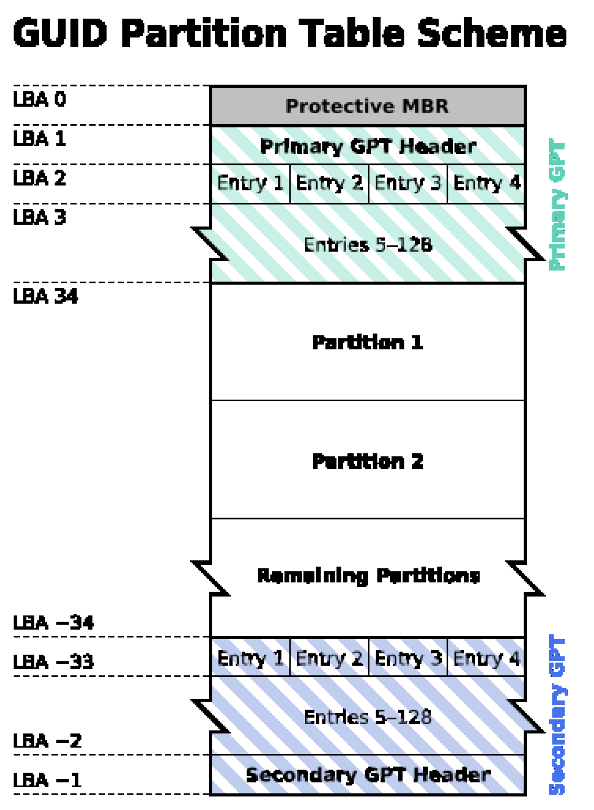

# Linux程序设计--第一课

> By Leonezhurui, Software Engineering

## overview

偏实践的课程

时间紧迫，迅速深入

shell编程需要熟悉

汤恩义

邮箱：eytang@foxmail.com

### 为什么学习Linux

* Free software; Free spirit
* Open source; Source codes: precious learning material
* Linux/UNIX Software Development
  * C/C++, Java, Shell, Perl, PHP, Python, Ruby, Tcl/Tk …
* System/Network Administration
* Say no to monopoly
* Much more learning based on GNU/Linux
  * Distributed System, Embedded System
* Just for fun!
  * The DIY spirit

纠正读音

* Linux系统应用广泛

* 对学习开源生态有帮助

* 系统创新

* 在开源系统中，用户体验会较高

* 二次开发和扩展价值很高
* 研究价值很高

### Contents

* Linux基础
  * 什么是Linux，安装，基本操作与命令，开发工具
  * Unix‘s Philosophy
* Shell编程(不讲，自学)
* *系统程序设计*
  * 系统调用接口：文件管理、进程控制、进程间通信
* Linux驱动介绍
* 网络程序设计(选讲)
  * TCP/IP，Socket

开发原理

批处理

linux程序设计(重点，讲明白)

系统级编程(操作系统和用户态程序的不同)

### 课程特点

* 相关课程
  * 前驱：操作系统，数据结构，C语言程序设计，Linux系统基础
  * 后继：嵌入式系统，分布式系统，网络编程……
* 实践性强，涉及面广
* 侧重点：基本原理、关键技术、应用实例

装一个linux：ubuntu

虚拟机和实体机的差别(主要差别)：计时任务不是很准确

这本书关系比较密切：

Beginning Linux Programming, 3rd/4thedition, Neil Matthew, Richard Stones, Wiley Publishing, Inc.

## Ch1 Linux Basics

什么是linux

* 根据GNU通用公共许可证开发的免费Unix类型的操作系统。特点如下：
  * 开源
  * 受欢迎的
  * 支持大多数可用平台

注意：UNIX和Linux是两套不同的操作系统

UNIX 1969年诞生

BSD: 1978, Berkeley Software Distribution(MacOS基于此开发)

1991年，Linus开发Linux

GNU组织：希望做开源

提倡开发者开发开源软件(包括编译器，浏览器，库)

GNU和Linux

* GNU/Linux System
  * Linux kernel
  * GNU software/library
* Distributions：
  * Ubuntu, Red Hat, Debain, SuSe, Mandrake, Redflag…

硬件在变化，使得操作系统也在不断地更新升级。

发行版：会修改内核，会配和内核配套的软件

Debian理念：一定要配自由软件，不会配商业软件

Ubuntu理念：用户好用就行

不同的发行版会在几乎相同的内核上会配套自己的外围软件。

### Linux协议

GPL协议-GNU General Public License

不允许你使用这个软件来赚钱

不允许基于开源软件二次开发来赚钱

其他的协议：

MacOS不免费分发，所以MacOS基于的是BSD，BSD有自己的BSD协议，但是由于BSD并没有linux这么成熟，MacOS的开发难度会大一点。

QT开源界面库，基于QT开发商业软件则需要分一部分收益给QT。

### Linux安装

Linux安装的是发行版

Ubuntu

All installation programs need to perform essentially the same steps:

* Choose language, keyboard type, mouse type
* Create partitions **(磁盘分区)
* Setup a boot loader **(系统引导)
* Configure network
* Configure user and authentication
* Select package groups
* Configure X(X表示图形界面的系统软件框架)
* Install packages
* Create boot disk

重点讲命令行界面，是使用开源系统的基础

Windows系统中不可以将图形用户界面卸载

### 分区理论

两个分区组织方式(完全不相同)：

MBR(master boot record)

上图是Linux和Windows双系统。

限制：

1. MBR硬盘分区不能超过4T(只能使用4T的磁盘空间)

2. 分区的个数不能超过4个主分区

1. 主分区和扩展分区是MBR上的概念(MBR下的硬盘分区有三种，主磁盘分区、扩展磁盘分区、逻辑分区。)
2. 上图中的Linux分区是三个小分区，三个逻辑分区；Windows95装在一个主分区中
3. 多于4个主分区的话：三个主分区和一个扩展分区，扩展分区中分逻辑分区；一个扩展分区中只能装4个逻辑分区
4. 扩展分区和主分区只是名称上的区别。
5. 不用主分区的话，就可以全都分为逻辑分区。

GPT(GUID Partition Table)

新的硬件必须要有新的代码与其对应

不要在老的机器上装新的分区组织方式

### 补充

#### MBR、扩展分区、逻辑分区

MBR是整个硬盘最重要的区域，一旦MBR物理实体损坏时，则该硬盘就差不多报废了，一般来说，MBR有512个字节，且可以分为两个部分：

1. 第一部分有446个字节，用于存放**引导代码**，即是bootloader。
2. 第二部分有64个字节，用于存放**磁盘分区表**.其中，每个分区的信息需要用**16个字节**来记录。因此，**一个硬盘最多可以有4个分区**，这4个分区称之为**主分区和扩展分区**(extended)。

重点说明的是，**扩展分区不能直接使用，还需要将其划分为逻辑分区才行**，这样就产生了一个问题，既然扩展分区不能直接使用，但为什么还要划分出一定的空间来给扩展分区呢？这是因为，如果用户想要将硬盘划分为5个分区的话，那该如何？此时，就需要扩展分区来帮忙了。

由于MBR仅能保存4个分区的数据信息，如果超过4个，系统允许在额外的硬盘空间**存放另一份磁盘分区信息**，这就是扩展分区.若将硬盘分成3P+E，则E实际上是告诉系统，磁盘分区表在另外的那份分区表，即**扩展分区其实是指向正确的额外分区表**.本身扩展分区不能直接使用，还需要额外将扩展分区分成逻辑分区才能使用，因此，用户通过扩展分区就可以使用5个以上的分区了。

注意：所谓扩展分区，严格地讲**它不是一个实际意义的分区**，它仅仅是一个**指向下一个分区的指针**，这种指针结构将形成一个单向链表。

#### MBR原理

MBR：Master Boot Record，主分区引导记录。

主引导扇区是整个硬盘的第一扇区（主分区的第一个扇区），MBR就保存在主引导扇区中。另外，这个扇区里还包含了硬盘分区表DPT（Disk Partition Table），和结束标志字（Magic number）。扇区总计512字节，MBR占446字节（0000H - 01BDH），DPT占据64个字节（01BEH - 01FDH），最后的magic number占2字节（01FEH – 01FFH）。

#### GPT原理

GPT分区：全称为Globally Unique Identifier Partition Table，也叫做**GUID分区表**，它是UEFI 规范的一部分。由于硬盘容量的急速增长，MBR的2.2T容量难以满足要求，而UEFI BIOS的推广也为GPT的实现打下了坚实的技术基础，GPT应运而生。

GPT的结构图：

LBA：

**逻辑区块地址**(**Logical Block Address**, **LBA**)是描述计算机存储设备上数据所在区块的通用机制，一般用在像**硬盘**这样的辅助记忆设备。LBA可以意指某个数据区块的地址或是某个地址所指向的数据区块。

