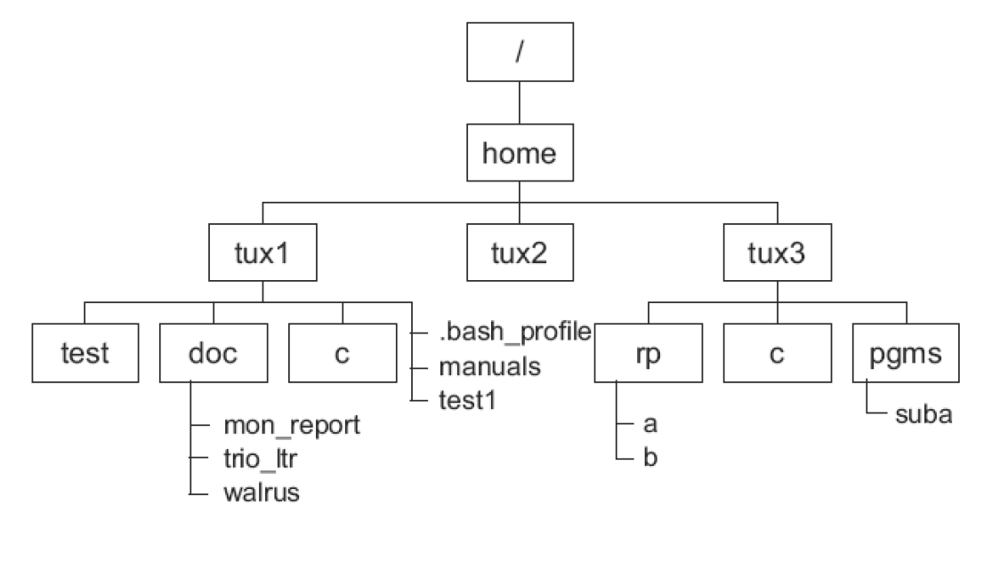
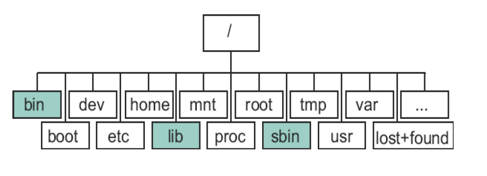

# Linux程序设计--第三课

> By Leonezhurui, Software Engineering


## Linux Basics

### Installing Software on Linux

* From a tarball

```shell
tar zxvf application.tar.gz
cd application
./configure
make
su -
make install
```


apt-get：**在线下载**；

update

update 是同步 /etc/apt/sources.list 和 /etc/apt/sources.list.d 中列出的源的索引，这样**才能获取到最新的软件包**。

upgrade

upgrade 是**升级已安装的所有软件包**，升级之后的版本就是本地索引里的，因此，在执行 upgrade 之前一定要执行 update, 这样才能是最新的。

dpkg：手动一个个地安装

aptitude

补充：software&update就是在调用apt-get


yum+rpm


### Multi-user and Multi-tasking

* Linux is a multi-user, multi-tasking operating system
  * Multiple users can run multiple tasks simultaneously, independent of each other.
* Always need to “log in” before using the system
  * Identify yourself with user name, password
* Multiple ways to log in to the system
  * Console: Directly attached keyboard, mouse, monitor
  * Serial terminal
  * Network connection

* Linux是**多用户，多任务**操作系统
   * 多个用户可以彼此独立地同时运行多个任务。
* 使用系统前始终需要“登录”
   * 用用户名，密码标识自己
* 多种方式登录系统
   * 控制台：直接连接的键盘，鼠标，显示器
* 串行终端
   * 网络连接


### Virtual Terminal

* In most Linux distributions, the console emulates a number of virtual terminals
* Each virtual terminal can be seen as a separate, directly attached console
* Different users can use different virtual terminals
* Typical setup:
* VT 1-6: text mode logins
* VT 7: graphical mode login prompt (if enabled)
* Switch between VTs with Alt-Fn (or Ctrl-Alt-Fn if in X)

虚拟终端

* 在大多数Linux发行版中，控制台模拟许多虚拟终端
* 每个虚拟终端都可以看作是一个单独的直接连接的控制台
  * 不同的用户可以使用不同的虚拟终端
* 典型设置：
  * VT 1-6：**文本模式登录**
  * VT 7：图形模式登录提示（如果启用）
* 使用Alt-Fn（如果在X中为Ctrl-Alt-Fn）在VT之间切换


### Linux Commands

* Everything on a Linux system can be done by typing commands
* the GUI (X-Window) is not needed for running a Linux System
* In order to type commands in X-Window you need to start a terminal emulator
* Command Prompt
* Can be configured yourself
* $ -“logged in as a regular user”,
* `#` -“logged in as root”

Linux命令

* Linux系统上的所有操作都可以通过键入命令来完成
* 运行Linux系统不需要GUI（X-Window）
* 为了在X-Window中键入命令，您需要启动终端仿真器
* **命令提示符**PS
  * 可以自己配置
  * `$`-“以普通用户身份登录”，
  * `＃`-“以root身份登录”

命令提示符：`用户名@计算机名:当前目录$`


Command Syntax

* Linux commands have the following fomat:`$ command option(s) argument(s)`

* Examples:

`$ ls`

`$ ls –l`

`$ ls /dev`

`$ ls –l /dev`


Some Basic Linux Commands

* passwd: Change your password
* mkpasswd: Generate a random password
* date, cal: Find out today’s date and display a calendar
* who, finger: Find out who else is active on the system
* clear: Clear the screen
* echo: Write a message to your screen
* write, wall, talk; mesg
* ……

write：给其他用户发信息

wall：write all给所有登陆到系统的用户发信息

talk：建立聊天session

mesg：可以屏蔽用户发来的信息


### Working with Files & Directories

* What is a file?
* A collection of data; 
* An object that can be written to, or read from, or both. A file has certain attributes, including access permissions and type. (susv3)
* File structure
* Generally: byte stream, record sequence, record tree
* In Linux: byte stream

处理文件和目录

* 什么是文件？
  * 数据的集合；
  * 可以写入或读取或同时读取和读取的对象。 文件具有某些属性，包括访问权限和类型。 （susv3）
* 文件结构
  * 通常：字节流，记录序列，记录树
  * 在Linux中：**字节流**

文件在逻辑上是字节，文件必然是整数字节。


### File Types(重要)

* regular file
* Text or code data; no particular internal structure
* character special file
* block special file
* Special files: represent hardware or logical devices
* Found in directory called /dev
* socket
* symbolic link
* Directory
* A table of contents; a list of files in that directory 

**文件类型(七种文件类型，要会写)**

* **普通文件**
  * 文本或代码数据； 没有特别的内部结构
* 字符特殊文件(设备文件)
* 块特殊文件(设备文件)
  * **特殊文件：代表硬件或逻辑设备**
  * 在名为/ dev的目录中找到

* socket：**数据接口文件**，最通常工行在`/var/run`这个目录中看到这种文件类型。
* 符号链接：
  * 软链接：类似windows上的快捷方式
  * 硬链接：**同一个文件有两个文件名**，创建出来的硬链接不占用磁盘空间和inode号。
* **目录(文件夹)**
* 目录； 该目录中的文件列表


设备文件类型和装载到linux的**设备驱动**是有关的；指向对应的设备

在linux中，以`.`开头的文件是隐藏文件。

可以尝试打开`/dev/random`字符文件，但是老师当场翻车，很多字符变成乱码了。但是打开`/dev/urandom`之后，格式又恢复了？？？


### Directory Structure

* All Linux directories are contained in one, virtual, “unified file system”.
* Physical devices are mounted on mount points
* Floppy disks
* Hard disk partition
* CD-ROM drives
* No drive letter like A:, C:, …

目录结构

* 所有Linux目录都包含在一个虚拟的“统一文件系统”中。
* 物理设备安装在安装点上
  * 软盘
  * 硬盘分区
  * CD-ROM驱动器
* 没有驱动器号，例如A：，C：，...



补充：`/home`目录

`/home`用户目录

root用户的用户目录并不是在`/home`，而是在`/root`目录中


Linux中的主文件夹



根目录下的主要目录：

1. `/boot`：内核、bootloader的配置
2. `/etc`：系统的配置文件所在地，下载软件的配置文件在也在这里
3. `/bin`：程序文件夹，例如`ls`，其实是在执行一个程序；也有一部分程序在`/usr/bin`(在我的linux上，/bin是/usr/bin的软链接)
4. `/mnt`
5. `sbin`：也有部分程序在`/sbin`，例如分区命令`fdisk`
6. `usr`：资源文件夹(和编程相关的)；编译器、默认的头文件、系统中的库文件
7. `lib`：库；
8. `proc`：存放着和内核相关的数据
9. `var`：系统里的可变数据，并不是存放在磁盘上的数据，一般是存放在内存中的数据。


修改环境变量PATH，临时修改可以直接`PATH=$PATH:/bin`，但是要永久生效得修改配置文件`/etc/profile`。


==根目录结构解析(解决)==

补充：**Linux根目录解析**

1. `/bin`：包含二进制可执行文件
2. `/sbin`：系统二进制文件，但是这个目录下的linux命令通常**由系统管理员使用，对系统进行维护**。例如`ifconfig/fdisk`。
3. `/etc`：**配置文件**，包含所有程序所需的配置文件
4. `/dev`：包含**设备文件**，这些包括终端设备、USB或连接到系统的任何设备。例如`/dev/tty1`
5. `/proc`：包含**系统进程相关信息**。这是一个虚拟的文件系统，包含有关正在运行的进程的信息；系统资源以文本信息形式存在。
6. `var`：**变量文件**，这个目录下可以找到内容可能增长的文件。这包括 - 系统日志文件（/var/log）;包和数据库文件（/var/lib）;电子邮件（/var/mail）;打印队列（/var/spool）;锁文件（/var/lock）;多次重新启动需要的临时文件（/var/tmp）;
7. `/tmp`：包含系统和用户创建的**临时文件**，当系统重新启动时，这个目录下的文件都将被删除。
8. `/usr`：包含二进制文件、库文件、文档和二级程序的源代码。
   1. `/usr/bin`中包含用户程序的二进制文件。`/bin`
   2. `/usr/sbin`中包含系统管理员的二进制文件。`/sbin`
   3. `/usr/lib`中包含了`/usr/bin`和`/usr/sbin`用到的库。
   4. `/usr/local`中包含了从源安装的用户程序。
9. `/home`：用home目录来存储他们的个人档案。
10. `/boot`：包含引导加载程序相关的文件。内核的initrd、vmlinux、grub文件位于/boot下。
11. `/lib`：系统库。包含**支持位于/bin和/sbin下的二进制文件的库文件**；库文件名为 `ld*或lib*.so.*`
12. `/opt`：可选的附加应用程序。
13. `/mnt`：**挂载目录**，临时挂载目录，系统管理员可以挂载文件系统。
14. `/media`：用于挂载**可移动设备**的临时目录。举例来说，挂载CD-ROM的/media/cdrom，挂载软盘驱动器的/media/floppy;
15. `/srv`：srv代表服务。包含服务器特定服务相关的数据。


Basic Commands(1)

* Commands used with directories:
  * pwd: print working directory
  * cd: change directory
  * mkdir: make directory
  * rmdir: remove directory
  * ls: list the contents of directories
    * -l, -a, -R options

-R参数，则会递归打印所有的子目录中的文件


Basic Commands(2)

* commands used with files:
  * touch: update the access and/or modification time of a files
  * cp: copy files
  * mv: move and rename files
  * ln: link files
  * rm: remove files
  * cat: printfile contents
  * more/less: display files page by page

注意：more不可以回退；less是可以回退的。

==上面的叙述是错误的！==

more和less都可以前进倒退，但是less支持的功能更多，例如搜索等。


