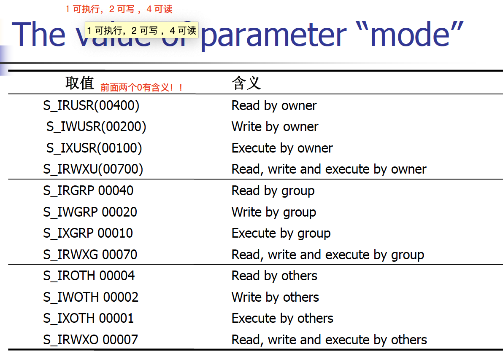
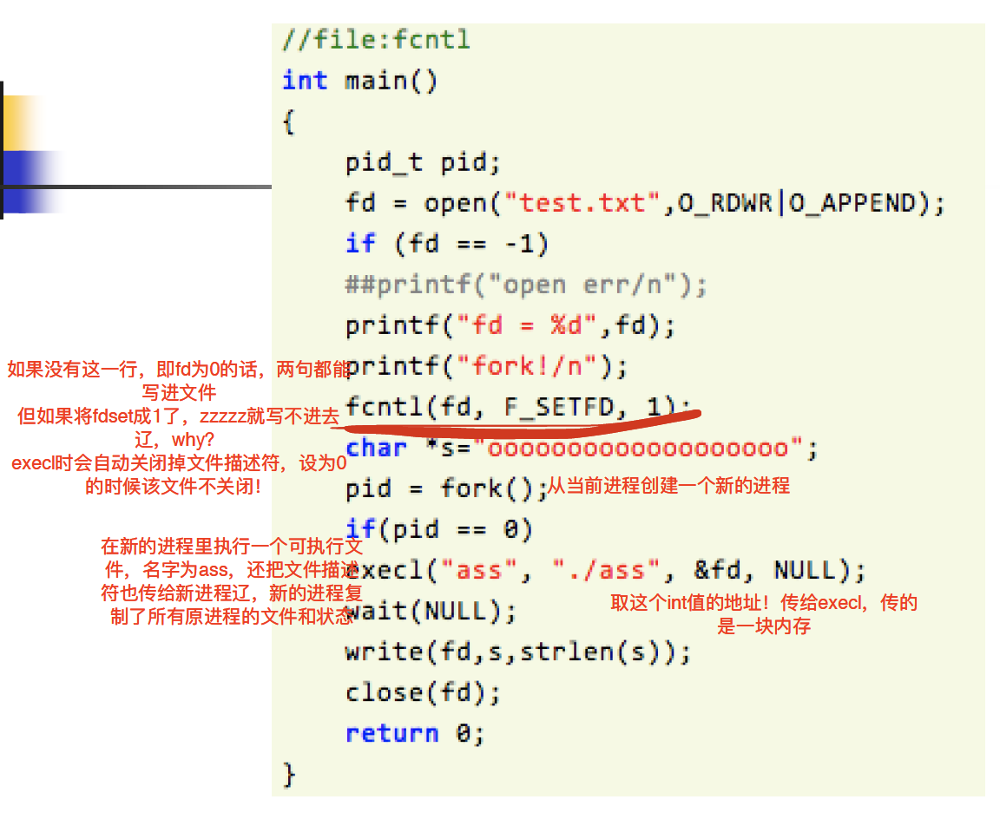
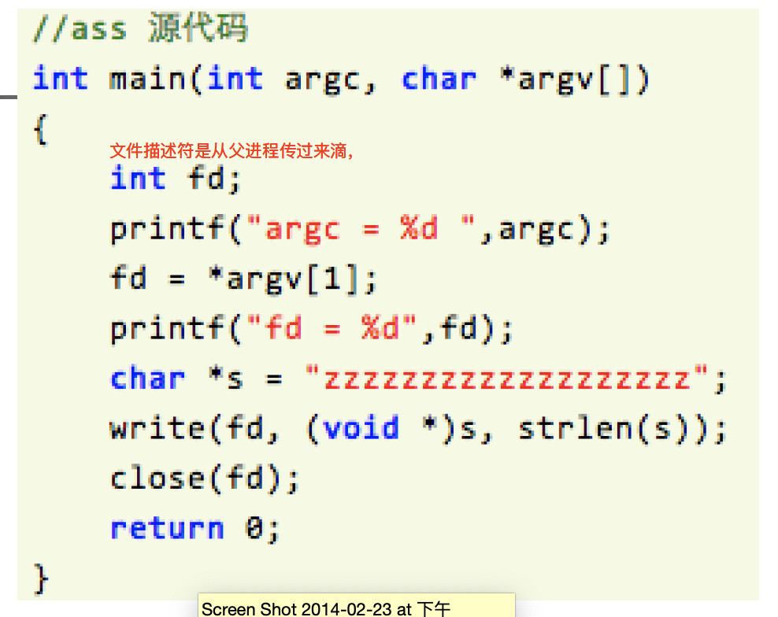

# Linux程序设计--第九课

> By Leonezhurui, Software Engineering


Parameter “mode”(权限，创建出来之后的读/写/执行，rwx)

* “mode”: specifies the permissions to use in case a new file is created.




需要多个权限的话，也是按位或。`S_IRUSR|S_IWUSR`就表示`rw-`。

注意这里的权限是**4位八进制数**。


Parameter “mode” & umask

* umask: a file protection mechanism
* The initial access mode of a new file
  * mode & ~umask


closeFunction

* Close a file descriptor

```C
#include <unistd.h>
int close(int fd);
(Return: 0 if success; -1 if failure) 
```

注意**打开的文件一定要关闭**。


read/writeFunction

* Read from a file descriptor

```C
#include <unistd.h>
ssize_t read(int fd, void *buf, size_t count);
(返回值: 读到的字节数，若已到文件尾为0，若出错为-1) 
```

* Write to a file descriptor

```C
#include <unistd.h>
ssize_t write(int fd, const void *buf, size_t count);
(返回值: 若成功为已写的字节数，若出错为-1) 
```


Example

* mycat.c 

```C
while ((n = read(STDIN_FILENO, buf, BUFSIZE)) > 0) 
	if (write(STDOUT_FILENO, buf, n) != n) 
		err_sys(“write error”);
if (n<0) 
	err_sys(“read error”);
```


lseek Function

* Reposition read/write file offset

```C
#include <sys/types.h>
#include <unistd.h>
off_t lseek(int fildes, off_t offset, int whence);
(Return: the resulting offset location if success; -1 if failure) 
```

* The directive “whence”:
  * SEEK_SET: the offset is set to “offset” bytes
  * SEEK_CUR: the offset is set to its current location plus “offset” bytes
  * SEEK_END: the offset if set to the size of the file plus “offset” bytes


dup/dup2 Function

* Duplicate a file descriptor(复制一个文件描述符)

```C
#include <unistd.h>
int dup(int oldfd);
int dup2(int oldfd, int newfd);
(Return: the new file descriptor if success; -1 if failure) 
```

* File sharing
  * Example: **redirection**

用在重定向中

ls：本质就是对1号文件描述符写数据(无论是printf还是cout)

将原来1号文件描述符从控制台输出转到其他文件中

打开一个文件，就会有一个文件描述符(例如是3号文件描述符)，使用dup2系统调用，就可以实现了。

```c
dup2(1, 1000);
fd=open("aaa.txt", ...);
dup2(fd, 1);//使用打开文件的文件描述符覆盖1号的，进行重定向
dup(1000, 1);//当重定向好了之后将1000号覆盖掉1号
 
```

==管道和参数？？？==


fcntl Function

* Manipulate a file descriptor

```C
#include <unistd.h>
#include <fcntl.h>
int fcntl(int fd, int cmd);
int fcntl(int fd, int cmd, long arg);
int fcntl(int fd, int cmd, struct flock *lock);//可以对文件加锁
(返回值: 若成功则依赖于cmd，若出错为-1) 
```

* The operation is determined by “cmd”.


fcntlFunction (cont‟d) 

* The value of “cmd”
  * **F_DUPFD**: Duplicate a file descriptor(和dup/dup2的功能是重复的)
  * **F_GETFD/F_SETFD**: Get/set the file descriptor‟s **close-on-exec** flag.(执行时是否关闭，文件描述符能否从父进程传递到子进程)
  * F_GETFL/F_SETFL: Get/set the file descriptor‟s **flags**(并不是所有情况都可以setfl的)
  * F_GETOWN/F_SETOWN: Manage I/O availability signals(告诉当前进程是否I/O传来的信号)(不要求理解深刻)
  * F_GETLK/F_SETLK/F_SETLKW: Get/set the file lock(暂时不讲)
* Example
  * dup/dup2 and fcntl

fcntl对于文件描述符的操作很全面




pid保存进程id(可以理解为int类型，linux下做了类型的重定义)

`if(fd == -1)`：异常处理(文件打开失败)

`fcntl(fd, F_SETFD, 1);`这里将**close-on-exec** flag设置为true，所以**调用execl的时候，fd会关闭**。

`fork()`：Linux下很特别的系统调用，是用来创建进程的；复制一份父进程，作为父进程的子进程。(注意：被启动的子进程，就从fork()之后继续执行；子进程并不重复执行，某种程度上子进程和父进程是完全一样的；只有fork()系统调用的返回值不一样)

父进程fork()函数的返回值就是子进程的pid，而子进程fork()函数的返回值是0。

子进程是复制了父进程，所以这里子进程有fd这个文件描述符。


==exec系列函数的使用==

**用另外一个程序代替当前进程，不会新开进程**(用当前进程执行新的程序)

启动一段新的程序，将新程序的内存覆盖掉当前进程的内存。

如果没有fork就执行execl，则当前shell的进程没有了(呗新的程序占用了)


注意：

这里是`pid==0`，才会执行execl。所以是**子进程执行了这个execl**。

`execl("ass", "./ass", &fd, NUKK)`：传递的是fd所在地址，这里是int类型的地址，而execl函数要求的传输类型是char类型的地址，所以这里是类型转换。(但是这里的fd的值不能太大，因为是按照char类型读取的，所以fd的值在128以内应该没有问题)

`wait(NULL)`：父进程就在这里等待，知道子进程执行完ass

最后的执行结果：test.txt文件中只会有"ooooo"，不会有''zzzzz"





ioctlFunction

* Control devices

```c
#include <sys/ioctl.h>
int ioctl(int d, int request, ...);
```

更改一种特殊类型的文件(块类型和字符类型的设备)


Standard I/O Library

* File stream
* Standard I/O functions


File Stream

* Stream and “FILE” structure
  * FILE* fp;
  * Predefined pointer: **stdin, stdout, stderr**(封装了012号文件描述符)
* Buffered I/O
  * Three types of buffers
    * Full buffer满缓存
    * Line buffer行缓存
    * No buffer无缓存
  * setbuf/setvbuf functions


Stream Buffering Operations

* Three types of buffering
  * block buffered (fully buffered) 
  * line buffered
  * unbuffered
* setbuf, setvbuf functions

```C
#include <stdio.h>
void setbuf(FILE *stream, char *buf);
int setvbuf(FILE *stream, char *buf, int mode, size_t size);
```


* void setbuf(FILE *steam, char *buf);
* int setvbuf(FILE *stream, char *buf, int type, unsigned size);
  * type：_IOFBF(满缓冲）_IOLBF(行缓冲）_IONBF(无缓冲）

补充：

1. setbuf用于打开或关闭流缓冲机制，参数buf指向一个长度为BUFSIZ（该常量在<stdio.h>中定义）的缓冲区；如果要关闭缓冲，则将buf设置为NULL即可。

2. setvbuf用于精确地设置所需的缓冲类型，mode取值如下：_IOFBF(全缓冲)/_IOLBF(行缓冲)/_IONBF(无缓冲)；如果指定了mode为带缓冲类型，而buf却为NULL，则系统会自动分配BUFSIZ个字节的缓冲区。


Standard I/O Functions

* Stream open/close
* Stream read/write
  * 每次一个字符的I/O
  * 每次一行的I/O
  * 直接I/O(二进制I/O) 
  * 格式化I/O
* Stream reposition
* Stream flush


Stream open/close

* Open a stream

```C
#include <stdio.h>
FILE *fopen(const char *filename, const char *mode);
int fclose(FILE *stream);
```

* Parameter “mode”
  * “r”:Open text file for **reading**.
  * “w”:Truncate file to zero length or create text file for writing.
  * “a”:Open for **appending**.(追加)
  * “r+”:Open for **reading and writing**.
  * “w+”:Open for reading and writing. The file is created if it does not exist, **otherwise it is truncated**.
  * “a+”:Open for **reading and appending**. The file is created if does not exist.


Stream open/close (cont‟d) 

* Close a stream

```C
#include <stdio.h>
int fclose(FILE *fp);
(Return: 0 if success; -1 if failure) 
```


