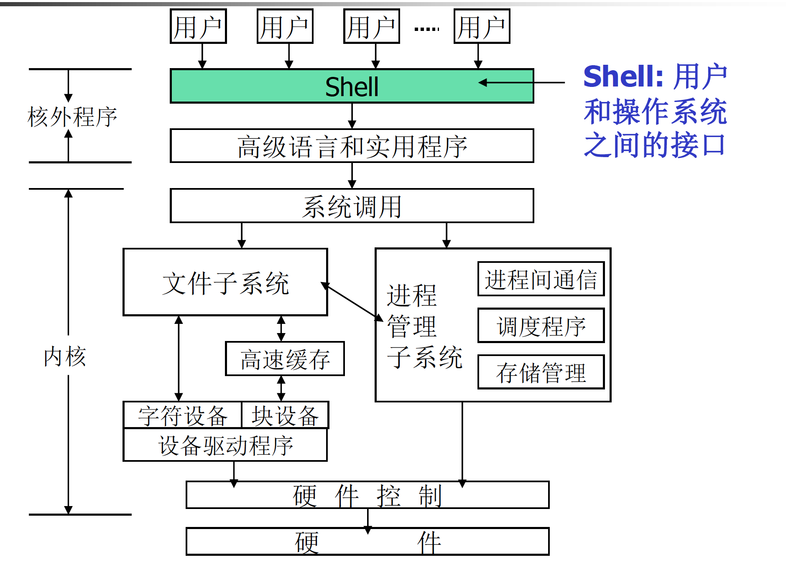

 Linux程序设计--第五课

## Shell编程

> By Leonezhurui, Software Engineering

注意：shell编程是需要自己学习的，阿汤哥不讲！！！


**What is Shell?**

* Shell: 
* A command interpreter and programming environment
* 用户和操作系统之间的接口
* 作为核外程序而存在





Shell: 作为核外程序而存在


各种不同的Shell

| **shell**名称 | 描述                                             | 位置            |
| ------------- | ------------------------------------------------ | --------------- |
| ash           | 一个小的shell                                    | /bin/ash        |
| ash.static    | 一个不依靠软件库的ash版本                        | /bin/ash.static |
| bsh           | ash的一个符号链接                                | /bin/bsh        |
| bash          | “Bourne Again Shell”。Linux中的主角，来自GNU项目 | /bin/bash       |
| sh            | bash的一个符号链接                               | /bin/sh         |
| csh           | C shell, tcsh的一个符号链接                      | /bin/csh        |
| tcsh          | 和csh兼容的shell                                 | /bin/tcsh       |
| ksh           | Korn Shell                                       | /bin/ksh        |


Shell 的双重角色

* 命令解释程序
  * Linux的开机启动过程；进程树
  * Shell的工作步骤
    * 打印提示符；得到命令行；解析命令；查找文件；准备参数；执行命令
* 独立的程序设计语言解释器
  * KISS (Keep It Small and Stupid)
  * Reusable tools
  * Redirection and pipe


UNIX’s Philosophy (Examples)

* Redirection
* Use “echo”to create a file?
* Pipe
* Get the count of files in a directory?
* Show subdirectories and only subdirectories?
* ar t /usr/lib/libc.a | grep printf | pr -4 -t (?)

UNIX的哲学（示例）

*重定向
*使用“ echo”创建文件吗？

* 管道
  *获取目录中文件的数量？
  *仅显示子目录？


脚本是能在命令行直接输入的

* 但仅会执行一次


编写脚本文件

* 脚本文件
  * 注释
  * 退出码(exit code)
  * Example

```shell
#!/bin/bash
# Here is comments
for file in *; do
if grep –l POSIX $file; then
more $file
fi
done
exit 0
```


### 执行脚本文件

* 方法1:

`$ sh script_file `

* 方法2:

```shell
chmod +x script_file (chown, chgrp optionally)
./script_file
```

* 方法3:

  `source script_file`, or

  `. script_file`


用户环境

* .bash_profile, .bash_logout, .bashrc files
  * .bash_profile: 用户登录时被读取，其中包含的命令被bash执行
  * .bashrc: 启动一个新的shell时读取并执行
  * .bash_logout: 登录退出时读取执行
* Alias
  * alias/unaliascommand
* 环境变量
  * export command
  * export, env & set command


变量

* 用户变量
* 环境变量
* 参数变量和内部变量


用户变量

* 用户变量：

  * 用户在shell脚本里定义的变量

* 变量的赋值和使用

  ```shell 
  var=value
  echo $var
  ```

* read命令

  * 用法：read var 或read
  * REPLY variable

* 引号的用法

  * 双引号，单引号
  * 转义符“\”


### Read的用法


使用read编写一个简单的脚本


==脚本疑问？？？==这里的dat是啥玩意儿？

```shell
#!/bin/bash
count=1
cat dat|while read line
do 
	echo "$count:$line"
	count=$(($count+1))
done
exit 0
```


引号的用法

* 单引号内的所有字符都保持它本身字符的意思，而不会被bash进行解释，例如，$就是$本身而不再是bash的变量引用符；\就是\本身而不再是bash的转义字符。
* 除了$、``（不是单引号）和\外，双引号内的所有字符将保持字符本身的含义而不被bash解释。


### 环境变量

环境变量：

shell环境提供的变量。通常是用大写字母做名字。

| 环境变量 | 说明                                                         |
| -------- | ------------------------------------------------------------ |
| $HOME    | 当前用户的登陆目录                                           |
| $PATH    | 以冒号分隔的用来搜索命令的目录清单                           |
| $PS1     | 命令行提示符，通常是”$”字符                                  |
| $PS2     | 辅助提示符，用来提示后续输入，通常是”>”字符                  |
| $IFS     | 输入区分隔符。当shell读取输入数据时会把一组字符看成是单词之间的分隔符，通常是空格、制表符、换行符等。 |

env：全部环境变量

set


find：查找文件

sed：在文本文件中查找或替换

grep：在文本文件中查找


```shell
sed 's/ A  /  B /g' code1.cpp
正则表达式
```


### 参数变量和内部变量

* 参数变量和内部变量：
  * 调用脚本程序时如果带有参数，对应的参数和额外产生的一些变量。

| 环境变量  | 说明                                                         |
| --------- | ------------------------------------------------------------ |
| $＃       | 传递到脚本程序的参数个数                                     |
| $0        | 脚本程序的名字                                               |
| $1, $2, … | 脚本程序的参数                                               |
| $*        | 一个全体参数组成的清单，它是一个独立的变量，各个参数之间用环境变量IFS中的第一个字符分隔开 |
| $@        | “$*”的一种变体，它不使用IFS环境变量。                        |


### 条件测试

* 退出码
* test命令
  * test expression 或[ expression ]
* test命令支持的条件测试
  * 字符串比较
  * 算术比较
  * 与文件有关的条件测试、逻辑操作


字符串比较

| 字符串比较  | 结果                       |
| ----------- | -------------------------- |
| str1 = str2 | 两个字符串相同则结果为真   |
| str1!=str2  | 两个字符串不相同则结果为真 |
| -z str      | 字符串为空则结果为真       |
| -n str      | 字符串不为空则结果为真     |


算术比较

| 算术比较        | 结果                             |
| --------------- | -------------------------------- |
| expr1 –eq expr2 | 两个表达式相等则结果为真         |
| expr1 –ne expr2 | 两个表达式不等则结果为真         |
| expr1 –gt expr2 | expr1 大于expr2 则结果为真       |
| expr1 –ge expr2 | expr1 大于或等于expr2 则结果为真 |
| expr1 –lt expr2 | expr1 小于expr2 则结果为真       |
| expr1 –le expr2 | expr1 小于或等于expr2 则结果为真 |


与文件有关的条件测试

| 文件条件测试 | 结果                         |
| ------------ | ---------------------------- |
| -e file      | 文件存在则结果为真           |
| -d file      | 文件是一个子目录则结果为真   |
| -f file      | 文件是一个普通文件则结果为真 |
| -s file      | 文件的长度不为零则结果为真   |
| -r file      | 文件可读则结果为真           |
| -w file      | 文件可写则结果为真           |
| -x file      | 文件可执行则结果为真         |


逻辑操作

| 逻辑操作       | 结果                        |
| -------------- | --------------------------- |
| ! expr         | 逻辑表达式求反              |
| expr1 –a expr2 | 两个逻辑表达式“And”（“与”） |
| expr1 –o expr2 | 两个逻辑表达式“Or”（“或”）  |


### 条件语句

* if语句
* case语句


**if语句**

* 形式

```shell
if [ expression ]
then
	statements
elif [ expression ]
then
	statements
elif …
else
	statements
fi
```

* 紧凑形式
  * ; (同一行上多个命令的分隔符)


* 例1(.bash_profile文件中)

```shell
if [ -f ~/.bashrc ]; then
	. ~/.bashrc
fi
```


* 例2

```shell
#!/bin/sh
echo “Is this morning? Please answer yes or no.”
read answer
if [ “$answer”= “yes”]; then
	echo “Good morning”
elif [ “$answer”= “no”]; then
	echo “Good afternoon”
else 
	echo “Sorry, $answer not recognized. Enter yes or no”
	exit 1
fi
exit 0
```


**case语句**

* 形式

```shell
case str in
	str1 | str2) statements;;
	str3 | str4) statements;;
	*) statements;;
esac
```


* Example

```shell
#!/bin/sh
echo “Is this morning? Please answer yes or no.”
read answer
case “$answer”in
	yes | y | Yes | YES) echo “Good morning!”;;
	no | n | No | NO) echo “Good afternoon!”;;
	*) echo “Sorry, answer not recognized.”;;
esac
exit 0
```


### 重复语句

* for语句
* while语句
* until语句
* select语句


**for语句**

* 形式

```shell
for var in list
do
	statements
done
```

* 适用于对一系列字符串循环处理


* Example

```shell
#!/bin/sh
for file in $(ls f*.sh); do
	lpr $file # 打印文件 line printer
done
exit 0
```


**while语句**

* 形式

```shell
while condition
do
	statements
done
```


* Example

```shell
quit=n
while [ “$quit”!= “y”]; do
	read menu_choice
	case “$menu_choice”in
		a) do_something;;
		b) do_anotherthing;;
		…
		q|Q) quit=y;;
		*) echo “Sorry, choice not recognized.”;;
	esac
done
```


```shell
a=0
while [ "$a" -le "$LIMIT" ]
do
	a=$(($a+1))
	if [ "$a" -gt 2 ]
	then
		break # Skip entire rest of loop.
	fi
	echo -n "$a ” # 不换行输出
done
```


until语句

* 形式

```shell
until condition
do
	statements
done
```

* Not recommended (while statement is preferred)


select语句(1)

* 形式

```shell
select item in itemlist
do
	statements
done
```

* 作用
  * 生成菜单列表


* 例(一个简单的菜单选择程序)

```shell
#!/bin/sh
clear
select item in Continue Finish
do
	case “$item” in
		Continue) ;;
		Finish) break ;;
		*) echo “Wrong choice! Please select again!”;;
	esac
done
```

* Homework: 用while语句模拟


补充：**read**

```shell
read [-rs] [-a ARRAY] [-d delim] [-n nchars] [-N nchars] [-p prompt] [-t timeout] [var_name1 var_name2 ...]

选项说明：
-a：将分裂后的字段依次存储到指定的数组中，存储的起始位置从数组的index=0开始。
-d：指定读取行的结束符号。默认结束符号为换行符。
-n：限制读取N个字符就自动结束读取，如果没有读满N个字符就按下回车或遇到换行符，则也会结束读取。
-N：严格要求读满N个字符才自动结束读取，即使中途按下了回车或遇到了换行符也不结束。其中换行符或回车算一个字符。
-p：给出提示符。默认不支持"\n"换行，要换行需要特殊处理，见下文示例。例如，"-p 请输入密码："
-r：禁止反斜线的转义功能。这意味着"\"会变成文本的一部分。
-s：静默模式。输入的内容不会回显在屏幕上。
-t：给出超时时间，在达到超时时间时，read退出并返回错误。也就是说不会读取任何内容，即使已经输入了一部分。
```


```shell
read num
[ $num -eq 2 ]
```

如果输入的是纯数值的话，那么比较的时候，可以使用算数比较，也可以使用字符串比较。


