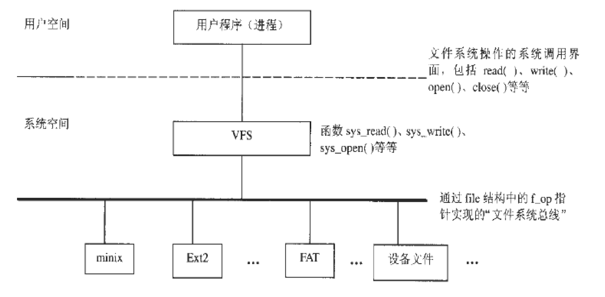
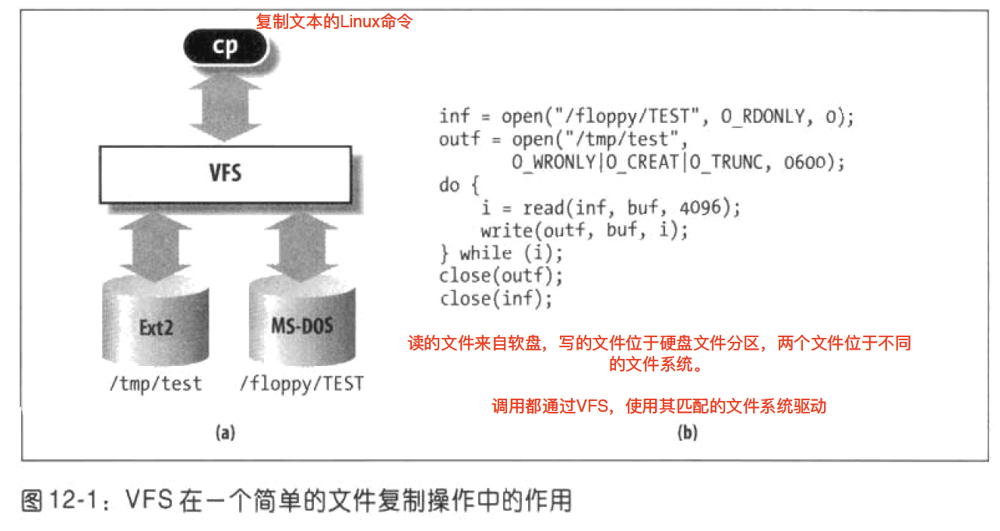
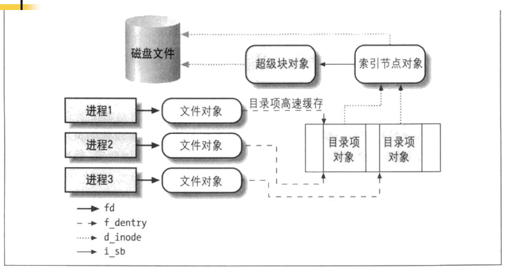
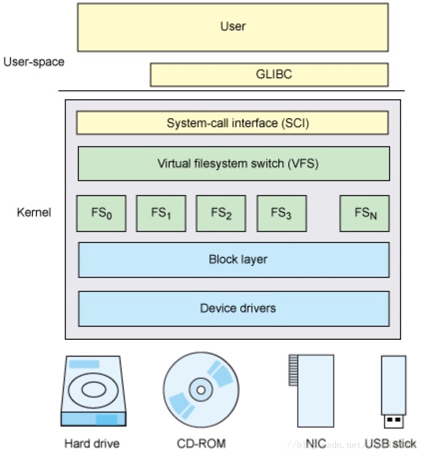
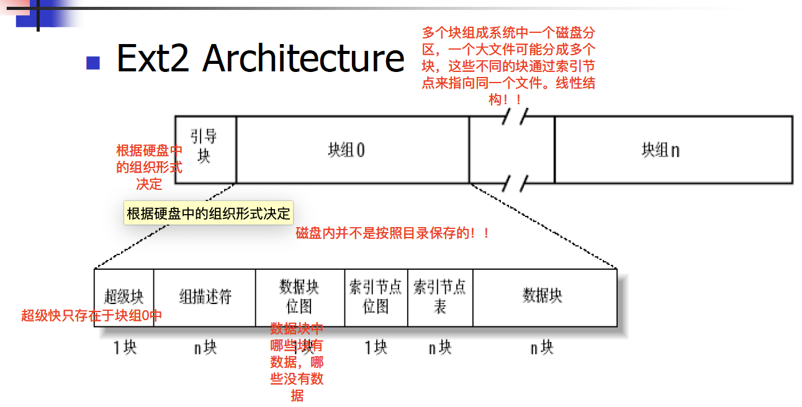
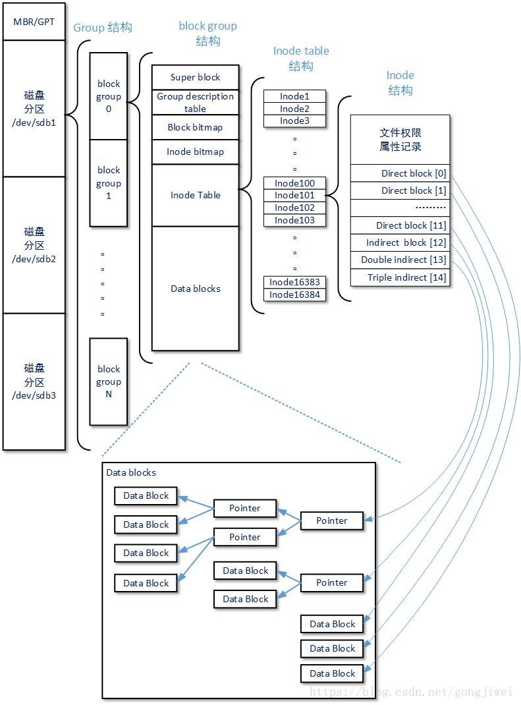
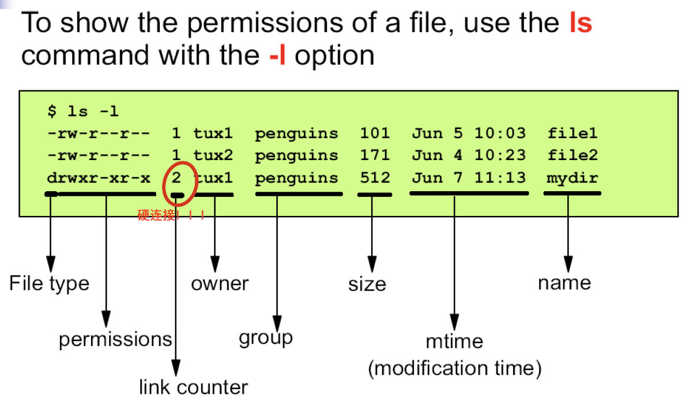

# Linux程序设计--第八课

> By Leonezhurui, Software Engineering


## 文件系统

What is File and File System?

* File
  * An object that can be written to, or read from, or both. A file has certain attributes, including access permissions and type.
* File system
  * A collection of files and certain of their attributes. It provides a name space for file serial numbers referring to those files.


文件系统的多种含义

* 文件系统
* Linux内核源代码情景分析，P415


File Types and Structure

* File types
  * regular file
  * character special file
  * block special file
  * fifo
  * socket
  * symbolic link
  * directory
* File structure
  * Byte stream; no particular internal structure


File Systems in Linux

* Virtual File system Switch (VFS) 







## VFS Model(会考)

* Virtual; only exists in memory
* Components:(这个考试会考)
  * super block：超级块
  * i-node object：inode
  * file object：文件对象
  * dentry object：目录项对象




* 超级块对象：什么类型的文件系统，文件系统所需要的所有参数

* inode索引节点对象：**真正的文件**，索引节点代表着磁盘上的文件

* 文件对象：不对应磁盘上的文件；当前系统将这个文件打开了，open是创建该文件的文件对象

* 目录项对象：某一个索引节点(记录文件名，目录结构在目录项对象上)

逻辑结构

文件存储在磁盘上的时候，一个索引号对应磁盘上的一个文件

open之后不关闭的话，内核下的文件对象就不会被释放掉，这样的话内核的资源就会被占用着，可能会存在一定的问题。


## 补充VFS

### VFS

VFS（Virtual Filesystem Switch）称为**虚拟文件系统或虚拟文件系统转换**，是一个**内核软件层**，**在具体的文件系统之上抽象的一层**，用来处理与Posix文件系统相关的所有调用，表现为能够给各种文件系统提供一个通用的接口，**使上层的应用程序能够使用通用的接口访问不同文件系统**，同时也为不同文件系统的通信提供了媒介。



VFS的作用就是采用标准的Unix系统调用读写**位于不同物理介质上的不同文件系统**。VFS是一个可以让open()、read()、write()等系统调用**不用关心底层的存储介质和文件系统类型就可以工作的粘合层**。


### VFS model

**统一文件模型（common file model）**

VFS为了提供**对不同底层文件系统的统一接口**，需要有一个高度的抽象和建模，这就是VFS的核心设计——**统一文件模型**。

Unix家族的VFS的文件模型定义了**四种对象**，这四种对象构建起了统一文件模型。

- superblock：存储**文件系统基本的元数据**。如文件系统类型、大小、状态，以及其他元数据相关的信息（元元数据）
- index node（inode）：**保存一个文件相关的元数据**。包括文件的所有者（用户、组）、访问时间、文件类型等，**但不包括这个文件的名称**。文件和目录均有具体的inode对应
- directory entry（dentry）：**保存了文件（目录）名称和具体的inode的对应关系**，用来粘合二者，同时可以实现目录与其包含的文件之间的映射关系。另外也作为缓存的对象，缓存最近最常访问的文件或目录，提示系统性能
- file：一组逻辑上相关联的数据，被一个进程打开并关联使用(**文件对象是打开一个具体文件之后创建的一个内存数据结构**，与具体的进程和用户相联系。)


## Ext2 File System



超级块

组描述符：额外的参数


补充ext2文件系统结构图：




Hard link and symbolic link

* Hard link
  * **不同的文件名对应同一个inode**
  * **不能跨越文件系统**
  * 对应系统调用link
* Symbolic link
  * **存储被链接文件的文件名(而不是inode)实现链接**
  * **可跨越文件系统**
  * 对应系统调用symlink

硬链接不可以在不同的分区，且需要改文件系统需要支持硬链接。

同一个inode，不同的文件名。


Review “ls –l” 



link counter：硬链接计数


System Calls & Library Functions

* **都以C函数的形式出现**(在其他语言中，对应于其他语言的函数)
* 系统调用
  * Linux内核的对外接口; 用户程序和内核之间唯一的接口; 提供最小接口
* 库函数
  * 依赖于系统调用; 提供较复杂功能
  * 例：标准I/O库

```c++
extern C{} // 告诉编译器这里面的函数名不要修改
int fib(int i, char c){...}
int fib(double i, char c){...}
//注意在C语言中函数名是不会变的，而在C++中函数名是会变的，由于C++支持函数的重载。
```

Linux的C库函数是针对Linux系统调用来编写的，直接搬到windows上是不能运行的。


Unbuffered I/O & Buffered I/O(缓存)

* Unbuffered I/O
  * read/write ->System calls
  * File descriptor
  * Not in ANSI C, but in POSIX.1 and XPG3
* Buffered I/O
  * Implemented in standard I/O library
  * 处理很多细节, 如缓存分配, 以优化长度执行I/O等.
  * Stream -> a pointer to FILE


Basic I/O System Calls

* File descriptor
* Basic I/O
  * open/creat, close, read, write, lseek
  * dup/dup2
  * fcntl
  * ioctl


File Descriptor

* **File descriptor**(文件描述符)
  * A small non-negative **integer**(0/1/2/3/4这样的值，用来指向一个文件对象，各个进程中的文件描述符是独立的，用户态进程与内核交流的工具)
    * int fd;
  * (in **<unistd.h>**) 类unix系统的头文件
    * **STDIN_FILENO (0), STDOUT_FILENO (1), STDERR_FILENO (2)** 
    * 在一个系统下，创建一个进程，预分配的三个文件描述符(system.in是0号文件描述符，system.out是1号，system.error是2号)
* General steps of file operation
  * open-read/write-[lseek]-close


Example

```C
/* a rudimentary example program */
#include <fcntl.h> //linux特有的头文件，一般就是系统调用
main()
{
	int fd, nread;
	char buf[1024];
  
	/*open file “data” for reading */
	fd = open(“data”, O_RDONLY);//注意这里返回的是int值，这是与高级语言不一样的返回值
  
	/* read in the data */
	nread = read(fd, buf, 1024);
  
	/* close the file */
	close(fd); //释放文件对象
}
```


open/creatFunction

```C
Open and possibly create a file or device
#include <sys/types.h> //看到sys明显是和系统相关的
#include <sys/stat.h>
#include <fcntl.h>
int open(const char *pathname, int flags);
int open(const char *pathname, int flags, mode_t mode); //注意到这里有两个open函数，但是C语言是不支持重载的。这里用的是可变参数
int creat(const char *pathname, mode_t mode);
(Return: a new file descriptor if success; -1 if failure)
```

Java中的布尔值肯定不止一个bit，可能占用几个字节。


Parameter “flags”

* “flags”: file access mode
  * One of **O_RDONLY, O_WRONLYor O_RDWR** which request opening the file read-only, write-only or read/write, respectively, bitwise-or‟d with zero or more of the following: ( All defined in /usr/include/fcntl.h) 
    * O_APPEND: the file is opened in append mode
    * O_TRUNC: If the file already exists and is a regular file and the open mode allows writing will be truncated to length 0.
    * O_CREAT: If the file does not exist it will be created.
    * O_EXCL: When used with O_CREAT, if the file already exists it is an error and the open will fail.(硬要创建一个文件)
    * …
* “creat” function: equivalent to open with flags equal to **O_CREAT|O_WRONLY|O_TRUNC** 
* 所以create的函数调用中并没有flag标志位

注意这里的`|`是C语言的语法，按位或

