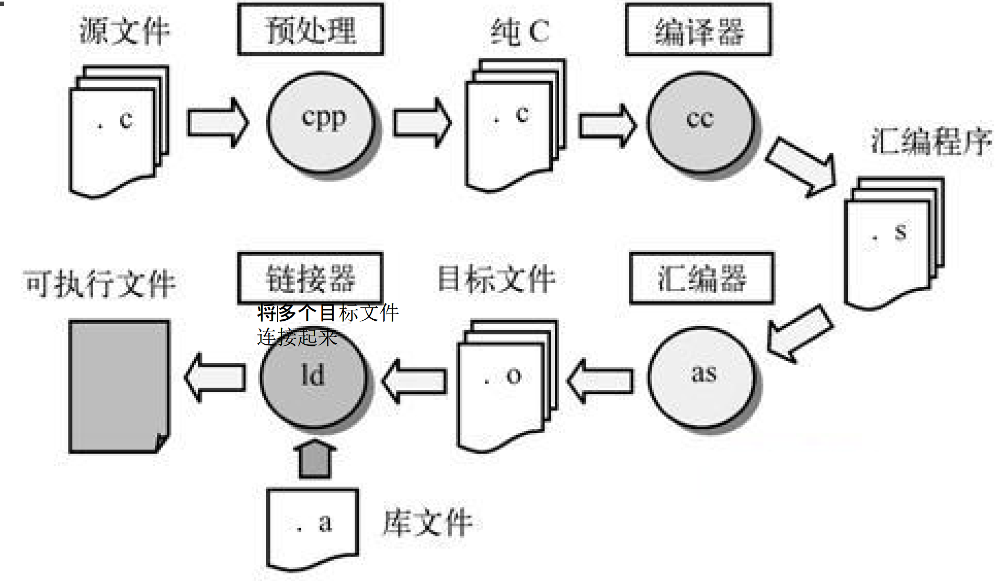

# Linux程序设计--第六课

> By Leonezhurui, Software Engineering


## 编程原则

* Abstract vs. Concrete
* 库(API)的调用与选择

从技术角度，一般使用标准库，如果使用商业库，会给对方平台带来一定的利益，但对自己来说，平台移植性较低


编程工具

* 编辑工具
  * vi, emacs
* 编译、链接
  * gcc
* 调试
  * gdb
* make命令
* 版本控制工具
  * CVS等


Programming Language

* High-level Language
  * C/C++, Java, Fortran…
  * ELF binary format
  * Excutable and Linkable Format
  * 工具接口标准委员会(TIS)选择了正在发展中的ELF体系上不同操作系统之间可移植的二进制文件格式
* Script 
  * Shell: sh/bash, csh, ksh
  * Perl, Python, tcl/tk, sed, awk… 


exe

elf


Development Tools

* GCC
  * GNU C Compiler -> GNU Compiler Collection
  * The gcc command: Front end
* GDB
  * GNU Debugger
  * The gdb command
  * xxdgb, ddd…
* Binary utilities
  * as, ld, ar, ldd…
* Make 


最简单的编译链接图(Win)


编译链接图(展开) 



动态库作用：

1. 不放在可执行文件中，放在外面

2. 升级的时候会很方便

动态库会存在冲突(版本问题)


#if预处理操作

思考：两者的区别

```c++
if(){
  
}else{
  
}
//注意这是程序设计语言的语句，预处理的时候是完全不管的，原封不动保留的，会编译成cpu条件跳转的指令。对应的二进制码里面是有条件判断的。动态时判断。

#if

#else

#endif

//#if是预编译指令，在编译器编译之前就会处理掉。对应的二进制码里面是没有条件判断的。静态时判断。条件必须是预处理时能够判断的条件，在这个时候是不知道变量的值的。
```


编译链接图(头文件展开)


头文件

`#include<...h>`：**预处理阶段，在编译之前**，按照文件名找到文本文件，将文本内容替换掉这个头文件。

头文件中有什么呢？


```c
int Qtf(char*);
int mian(int argc, char** argv){
  Qtf("Hello");
  return 0
}
```

```linux
gcc -o lin.o -c linux002.c
// 这个不会报错，即编译器不会报错
gcc -o lin.o linux002.c
// 这个会报错，链接器会报错
```


编译和汇编的区别：

1. 源代码经过编译得到汇编代码
2. 汇编码经过汇编得到机器代码


常用命令

* gcc -c (编译)
* gcc (链接或者编译+ 链接)
* g++ (C++对应的命令，其实就是换了前端)


GCC options (1)

* Usage:
  * gcc [options] [filename]
* Basic options:
  * -E: 只对源程序进行预处理(调用cpp预处理器)
  * -S: 只对源程序进行预处理、编译
  * -c: 执行预处理、编译、汇编而不链接
  * -o output_file: **指定输出文件名**
  * -g: **产生调试工具必需的符号信息**
  * -O/On: 在程序编译、链接过程中进行**优化处理** (-O0是不开优化，-O1/2/3优化程度逐渐加强)
  * -Wall: 显示所有的警告信息


编译器会有bug，绝大多数在于优化上。


补充：

1. 调试的时候仍然使用的是本地编译好的二进制文件
2. 编译的时候没开优化，源代码的语句编译成的汇编码是多条语句，是一对多的关系
3. 调试器：在执行编译后的二进制码，二进制码会被打标签，记录哪一个源代码的哪一行编译而来的。
4. -g参数：告诉编译器，每一个编译完的二进制码上打上**文件名和行号**的标签
5. 编译完之后，用其他的机器调试可能是不行的，因为file的路径一般是不一样的。
6. -O优化，二进制码打乱，不优化的话，源代码和汇编代码是对应着的；一些无关的操作会被编译器扔掉；会把源代码和汇编码之间一对多的关系破坏掉


Basic options:(注意中间没有空格)

* `-Idir`: 指定额外的**头文件**搜索路径
* `-Ldir`: 指定额外的**库文件**搜索路径
* `-lname`: 链接时搜索指定的库文件
* `-DMACRO[=DEFN]`: 定义MACRO宏(针对#define)

在不改变源代码的基础上，在文件中添加#define预处理指令。

```shell
gcc -DAA=2
# 就相当于在源码中添加了#define AA 2
```


链接器在链接的时候如何找到库文件？

编译器不需要额外指定头文件的文件名(因为源码中有头文件名)


```shell
-lm
# 库文件名为libm.a
```

