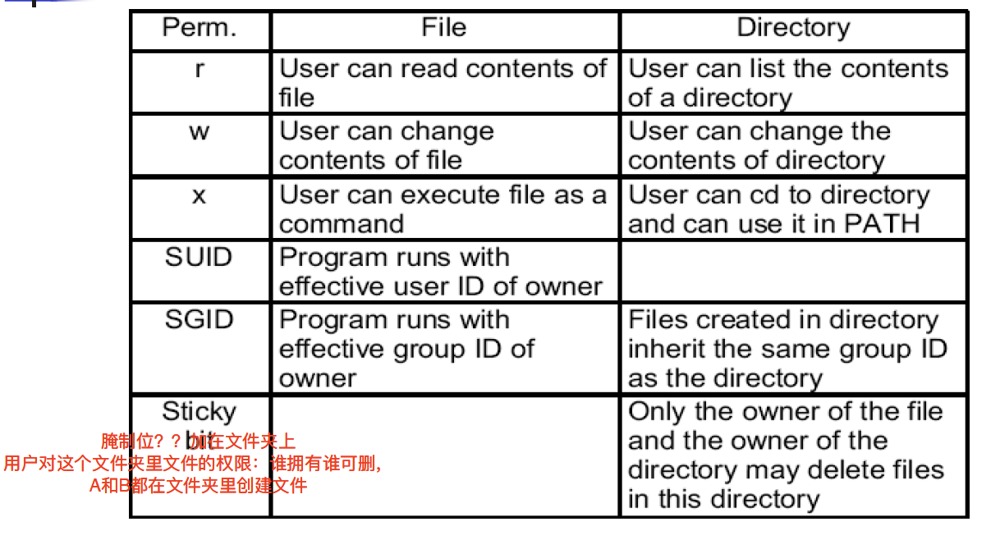
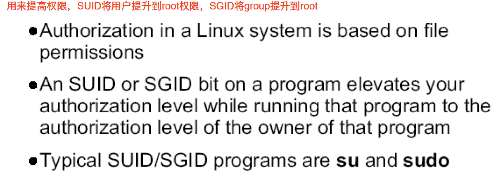
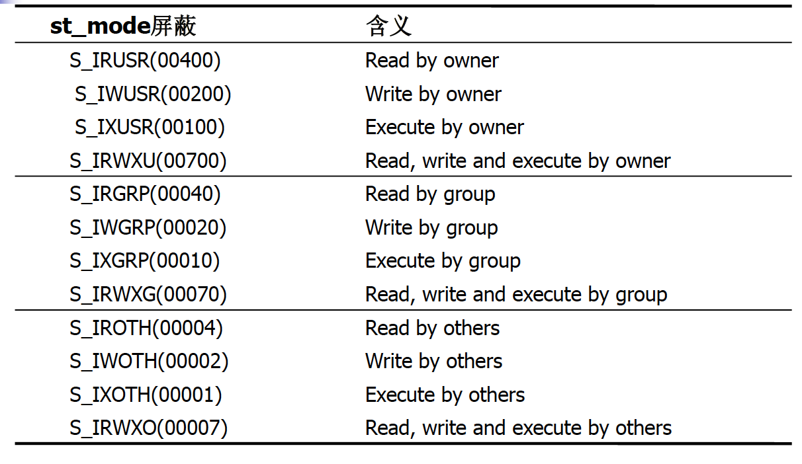
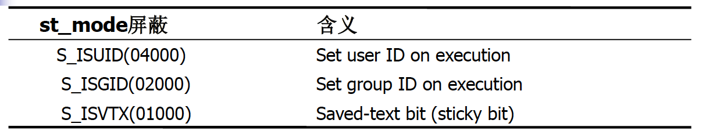

# Linux程序设计--第十一课

> By Leonezhurui, Software Engineering


Formatted I/O

* scanf, fscanf, sscanf functions

```C
#include <stdio.h>
int scanf(const char *format, ...);//从0号文件描述符里读
int fscanf(FILE *stream, const char *format, ...);//从文件中读数据。给一个文件的流指针(包含文件描述符)，每次读一行，当作是字符串，按照format格式做匹配，然后填到后面的变量中。注意后面的变量必须是地址。
int sscanf(const char *str, const char *format, ...);//由内存buffer中取出字符串，进行操作
```

* Use fgets, then parse the string.


Formatted I/O (cont‟d) 

* printf, fprintf, sprintf functions

```C
#include <stdio.h>
int printf(const char *format, ...);
int fprintf(FILE *stream, const char *format, ...);//写到文件中
int sprintf(char *str, const char *format, ...);//拿到这个字符串，写到char* buffer中
```


Reposition a stream

* fseek, ftell, rewind functions

```C
#include <stdio.h>
int fseek(FILE *stream, long int offset, int whence);//给一个文件流指针，跳转量，跳转方式(三个值，三个#define SEEK_SET\SEEK_CUR\SEEK_END)
long ftell(FILE *stream);//得到当前跳转位置
void rewind(FILE *stream);//重置，将跳转到文件开头
```

* fgetpos, fsetpos functions ( Introduced in ANSI C) 

```C
#include <stdio.h>
int fgetpos(FILE *fp, fpos_t *pos);
int fsetpos(FILE *fp, const fpos_t *pos);
//fpos_t是自定义类型，适用于文件相当大的时候
```


Flush a stream

* **刷新文件流。把流里的数据立刻写入文件**

```C
#include <stdio.h>
int fflush(FILE *stream);//防止数据流在缓存中
```


Stream and File Descriptor

* **确定流使用的底层文件描述符**

```C
#include <stdio.h>
int fileno(FILE *fp);
```

* **根据已打开的文件描述符创建一个流**

```C
#include <stdio.h>
FILE *fdopen(int fildes, const char *mode);
```


Temporary File(创建临时文件)

* Create a name for a temporary file

```C
#include <stdio.h>
char *tmpnam(char *s);
(返回值: 指向唯一路径名的指针) 
```

* Create a temporary file

```C
#include <stdio.h>
FILE *tmpfile(void);
(返回值: 若成功为文件指针，若出错为NULL) 
```


**Advanced System Calls**

针对文件属性和文件夹的；文件权限

* Handling file attributes
  * stat/fstat/lstat, ...
* Handling directory


stat/fstat/lstat functions

* Get **file status**

```C
#include <sys/types.h>
#include <sys/stat.h>
#include <unistd.h>

int stat(const char *filename, struct stat *buf);//buf需要实现开好
int fstat(int filedes, struct stat *buf);
int lstat(const char *file_name, struct stat *buf);//stat系统内部定义的结构体
(Return: 0 if success; -1 if failure) 
```

如果使用stat来查看软链接，则会返回软链接所指向的那个原始文件的文件属性；而如果使用lstat，则会返回软链接的文件属性。


struct stat

```C
struct stat {
	mode_t st_mode; /*file type & mode*/
	ino_t st_ino; /*inode number (serial number)*/
	dev_t st_rdev; /*device number (file system)设备号*/ 
	nlink_t st_nlink; /*link count硬链接计数*/
	uid_t st_uid; /*user ID of owner*/
	gid_t st_gid; /*group ID of owner*/
	off_t st_size; /*size of file, in bytes*/
	time_t st_atime; /*time of last access*/
	time_t st_mtime; /*time of last modification*/
	time_t st_ctime; /*time of last file status change*/
	long st_blksize; /*Optimal block size for I/O*/
	long st_blocks; /*number 512-byte blocks allocated*/
};
```

一个数据块是不可以被两个文件共享的，碎文件会占用一整块的空间。

`st_mode`

比特串(基本上都是使用宏)


Test macros for file types

* Defined in <sys/stat.h> 

| Macro      | File type                 |
| ---------- | ------------------------- |
| S_ISREG()  | regular file              |
| S_ISDIR()  | directory                 |
| S_ISCHAR() | character special file    |
| S_ISBLK()  | block special file        |
| S_ISFIFO() | fifo                      |
| S_ISLNK()  | symbolic link(特指软链接) |
| S_ISSOCK() | socket                    |

==注意：这里的S_ISCHAR()也存在一定的问题，这个宏函数在ubuntu上是S_ISCHR()。==


File Permission -Basics 



SUID

SGID

Sticky bit(粘滞位)：用在文件夹中，只有文件的拥有者和root可以(临时文件夹/tmp，所有用户都应该对/tmp文件夹有写权限；但是临时文件夹的权限都放开也是不行的，因为任何的访客都可以改这个文件)


Deep into SUID, SGID, Sticky bit 



su、sudo本身就是程序，只是在权限上添加了SUID和SGID

File permission







* Example: testing file permission

```C
if (buf.st_mode & S_IRUSR) //按位与
	printf(“readable by owner”);
else
	printf(“unreadable by owner”);
```


access function

* **按实际用户ID和实际组ID测试文件存取权限**

```C
#include <unistd.h>
int access(const char *pathname, int mode);
(Return: 0 if success; -1 if failure) 
```

* Parameter “mode”
  * R_OK, W_OK, X_OK, F_OK(是否存在)


chmod/fchmod functions

* Change permissions of a file

```C
#include <sys/types.h>
#include <sys/stat.h>
int chmod(const char *path, mode_t mode);
int fchmod(int fildes, mode_t mode);//系统调用，文件描述符已经打开
(Return: 0 if success; -1 if failure) 
```


chown/fchown/lchown functions

* Change ownership of a file(修改文件的拥有者和组ID)

```C
#include <sys/types.h>
#include <unistd.h>
int chown(const char *path, uid_t owner, gid_t group);
int fchown(int fd, uid_t owner, gid_t group);
int lchown(const char *path, uid_t owner, gid_t group);
(Return: 0 if success; -1 if failure) 
```

chown默认修改时软链接指向的原始文件，lchown修改的是软链接的拥有者


umask function

* **为进程设置文件存取权限屏蔽字，并返回以前的值**

```C
#include <sys/types.h>
#include <sys/stat.h>
mode_t umask(mode_t mask);
```

默认的文件权限是644，文件夹权限是755


### umask

umask用于设置用户创建文件或者目录的默认权限，umask设置的是权限的“补码”。

默认情况下的umask值是022(可以用umask命令查看），此时你建立的文件默认权限是644(6-0,6-2,6-2)，建立的目录的默认 权限是755(7-0,7-2,7-2)


基本权限

|      | r                        | w                                                            | x                                                        |
| ---- | ------------------------ | ------------------------------------------------------------ | -------------------------------------------------------- |
| 文件 | 可以查看文件内容         | 可以修改文件                                                 | 可以把文件启动为一个运行的程序                           |
| 目录 | 可以ls查看目录中的文件名 | 可以在目录中创建或者删除文件（只有w权限没法创建，需要x配合） | 可以使用cd 进入这个目录 ls-l显示目录内文件的元数据的信息 |


link/unlink functions

* Create a new link to (make a new name for) a file.(创建新的硬链接)

```C
#include <unistd.h>

int link(const char *oldpath, const char *newpath);

(Return: 0 if success; -1 if failure) 
```

* Delete a name and possibly the file it refers to.

```C
#include <unistd.h>
int unlink(const char *pathname);
(Return: 0 if success; -1 if failure) 
```


symlink/readlink

* Create a symbolic link (named newpath which contains the sting “oldpath”) 

```C
#include <unistd.h>
int symlink(const char *oldpath, const char *newpath);
(Return: 0 if success; -1 if failure) 
```

* Read value of a symbolic link

```C
#include <unistd.h>
int readlink(const char *path, char *buf, size_t bufsiz);
(Return: the count of characters placed in the buffer if success; -1 if failure) 
```

