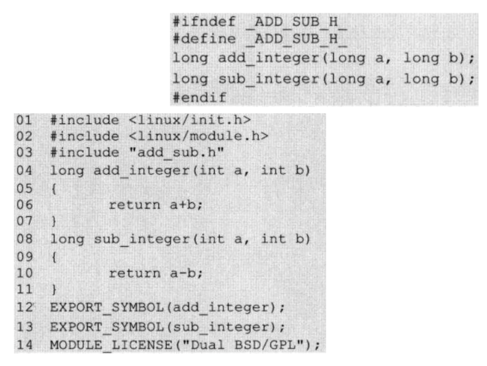
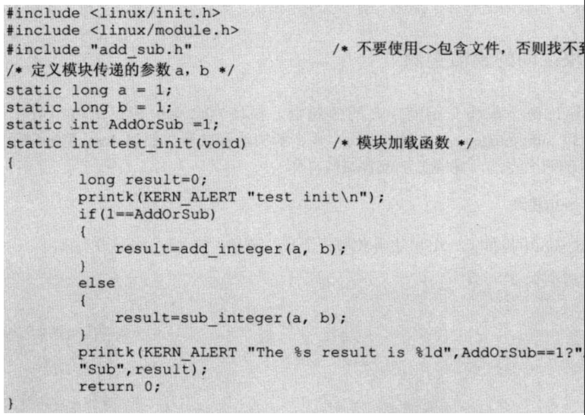
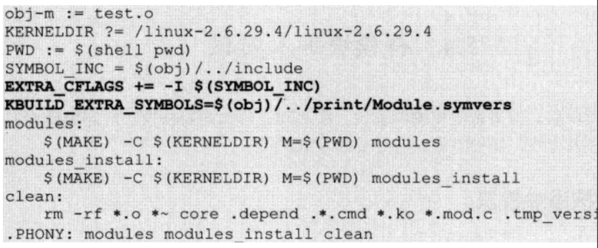
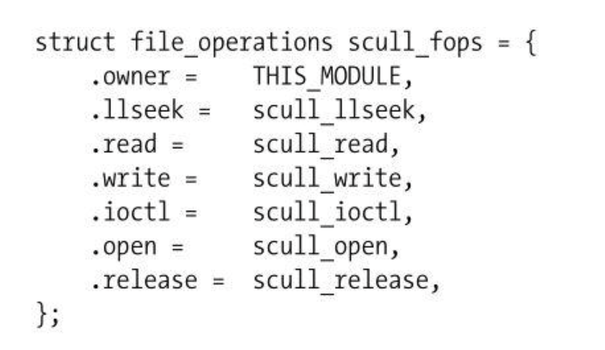
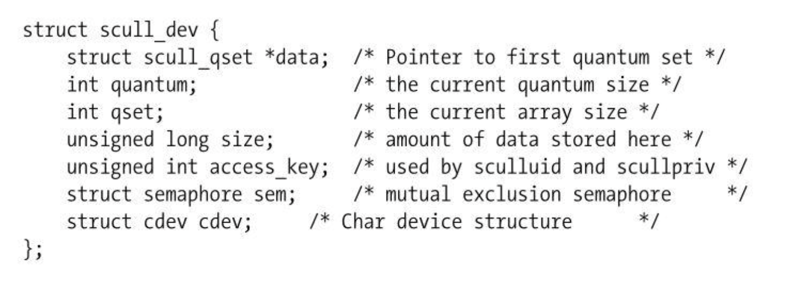
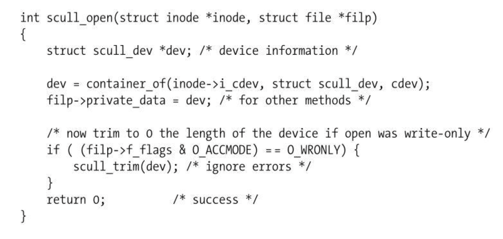

# Linux程序设计--第十三课

> By Leonezhurui, Software Engineering


模块参数传递

* 有些模块需要传递一些参数
* 参数在模块加载时传递 #insmod hello.ko test=2
* 参数需要使用module_param宏来声明 module_param(变量名称，类型, 访问许可掩码)
* 支持的参数类型
   Byte, short, ushort, int, uint, long, ulong, bool, charp Array (module_param_array(name, type, nump, perm))


```C
#include <linux/kernel.h> 
#include <linux/module.h> 
#include <linux/init.h>
#include <linux/moduleparam.h>

static int test; 
module_param(test, int, 0644);
static int __init hello_init(void) {
	printk(KERN_INFO “Hello world test=%d \n” , test);
	return 0; 
}
static void __exit hello_exit(void) {
	printk(KERN_INFO "Goodbye world\n"); 
}
MODULE_LICENSE("GPL"); MODULE_DESCRIPTION("Test"); MODULE_AUTHOR("xxx"); module_init(hello_init); module_exit(hello_exit);
```


模块之间的通讯实例

* 本实例通过两个模块来介绍模块之间的通信。 模块add_sub提供了两个导出函数add_integer() 和sub_integer()，分别完成两个数字的加法和减 法。模块test用来调用模块add_sub提供的两个 方法，完成加法或者减法操作。

- 1.add_sub模块
- 2.test模块 
- 3.编译模块











导出符号表

* 如果一个模块需要向其他模块导出符号(方法或全局变 量)，需要使用:

  EXPORT_SYMBOL(name); EXPORT_SYMBOL_GPL(name);

* 注意:符号必须在模块文件的全局部分导出，不能在函数部分导出。 更多信息可参考 <linux/module.h>文件
* Modules仅可以使用由Kernel或者其他Modules导出的符 号不能使用Libc
* /proc/kallsyms 可以显示所有导出的符号


内核模块操作/proc文件

- /proc文件系统，这是内核模块和系统交互的两种主要方式之一。
- /proc文件系统也是Linux操作系统的特色之一。
- /proc文件系统不是普通意义上的文件系统，它是一个伪文件系统。
- 通过/proc，可以用标准Unix系统调用(比如open()、 read()、write()、 ioctl()等等)访问进程地址空间
- 可以用cat、more等命令查看/proc文件中的信息。
- 用户和应用程序可以通过/proc得到系统的信息，并可以改变内核的某些参数。
- 当调试程序或者试图获取指定进程状态的时候，/proc 文件系统将是你强有力的支持者。通过它可以创建更强大的工具，获取更多信息。


/proc相关函数

* create_proc_entry() 创建一个文件 
* proc_symlink() 创建符号链接
* proc_mknod() 创建设备文件
* proc_mkdir() 创建目录
* remove_proc_entry() 删除文件或目录


驱动类型

* Linux系统将设备分为3种类型:字符 设备、块设备和网络接口设备。
* 1.字符设备 Character Driver
* 2.块设备 Block Driver
* 3.网络接口设备 Network Driver


简单的字符设备驱劢程序

* 在Linux设备驱劢程序的家族中，字符 设备驱劢程序是较为简单的驱劢程序， 同时也是应用非常广泛的驱劢程序。 所以学习字符设备驱劢程序，对构建 Linux设备驱劢程序的知识结构非常的 重要。


文件操作 ——字符设备驱动的对上接口

- ssize_t (*read) (struct file *, char __user *, size_t, loff_t *);

- ssize_t (*write) (struct file *, const char __user *, size_t, loff_t *);

- int (*flush) (struct file *);

- int (*ioctl) (struct inode *, struct file *,

  unsigned int, unsigned long);

- ......


文件操作(file_operations) ——字符设备驱动的对上接口




两个基本结构 

* file 结构体
* inode 结构体
   – dev_t i_rdev;
   – struct cdev *i_cdev;


字符设备驱劢程序的初始化加载 过程

- 申请设备号
- 定义文件操作结构体 file_operations
- 创建并初始化定义结构体 cdev
- 将cdev注册到系统，并和对应的设备号绑定
- 在/dev文件系统中用mknod创建设备文件， 并将该文件绑定到**设备号**上


主设备号和次设备号

* 一个字符设备或者块设备都有一个**主设备号和次设备号**。
* 主设备号和次设备号统称为设备号。 主设备号用来表示一个特定的驱动程序。
* 次设备号用来表示使用该驱劢程序的 各设备。


申请和释放设备号

* int register_chrdev_region(dev_t first, unsigned int count, char *name);（确定使用一个设备）
* int alloc_chrdev_region(dev_t *dev, unsigned int firstminor, unsigned int count, char *name);（由系统自己分配一个空闲的设备号）
* void unregister_chrdev_region(dev_t first, unsigned int count);（返回系统中第一个空闲的）

注意：这不是系统调用，这是内核态的代码

设备名称不要超过64个字节


cdev结构体

* 在linux内核中**使用cdev结构体来描述字符设备**(系统预定义的)。该结构体是所有字符设备的抽象，其包含了大量字符设备所共 有的特性。


cdev结构体的初始化

```C
struct cdev *my_cdev = cdev_alloc();
my_cdev->ops = &my_fops;

void cdev_init(struct cdev *cdev, struct file_operations *fops);
```


自定义结构



驱动程序自定义的，必须要有cdev结构体


设备注册 

* 将设备注册到系统中:
* int cdev_add(struct cdev *dev, dev_t num, unsigned int count);
*  释放一个已经注册的设备:
* void cdev_del(struct cdev *dev);


实现file_operations中的各个函数



内核态打开一个字符设备的代码就是这样的


创建设备文件，并绑定到设备号

* 定义设备名device=scull
* 定义主设备号major=15
* 用户可以通过访问/dev/scull0来访问当前的驱劢程序