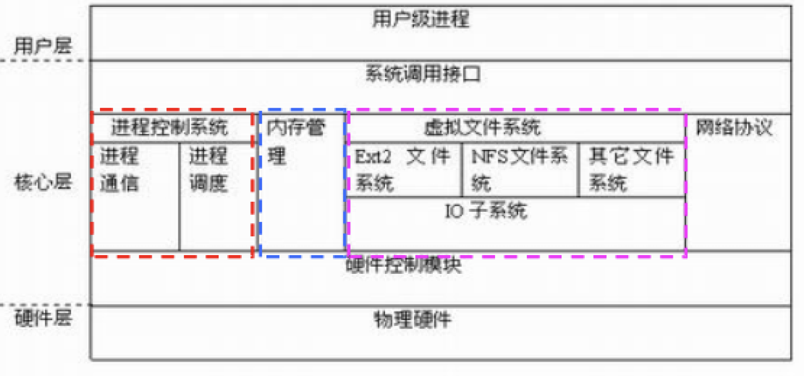

# Linux程序设计--第十二课

> By Leonezhurui, Software Engineering


Handling directories

* mkdir/rmdir
* chdir/fchdir, getcwd
* Read a director
  * opendir/closedir
  * readdir
  * telldir
  * seekdir

文件夹本身在Linux中仍然是一种文件类型，是用来记录文件结构的


mkdir/rmdir functions

* 创建一个空目录

```C
#include <sys/stat.h>
#include <sys/types.h>
int mkdir(const char *pathname, mode_t mode);
(Return: 0 if success; -1 if failure) 
```

* **删除一个空目录**

```C
#include <unistd.h>
int rmdir(const char *pathname);
(Return: 0 if success; -1 if failure) 
```

mkdir和rmdir和命令行中的命令刚好重名


chdir/fchdir functions

* Change working directory(切换文件夹)

```C
#include <unistd.h>
int chdir(const char *path);
int fchdir(int fd);//如果已经打开了文件(有文件描述符)
(Return: 0 if success; -1 if failure) 
```

* 当前工作目录是进程的属性，所以该函数只影响调用chdir的进程本身
  * cd(1) command


getcwd function

* **获得当前工作目录的绝对路径**

```C
#include <unistd.h>
char *getcwd(char *buf, size_t size);//写到缓存buf中
(返回值: 若成功则为buf，若出错则为NULL) 
```

命令行命令：`pwd`


Read a directory

* Data structures
  * DIR, struct dirent
* Operations
  * opendir/closedir
  * readdir
  * telldir
  * seekdir 


Data structures

* DIR

* The data type of directory stream objects

* in <dirent.h>

  ```C
  typedef struct __dirstream DIR;
  ```

* struct **dirent**(目录项)
* Directory item
* Defined in <dirent.h>

```C
ino_t d_ino; /* inode number */
char d_name[NAME_MAX + 1]; /* file name */
```


Operations

* 目录的打开、关闭、读、定位

```C
#include <sys/types.h>
#include <dirent.h>
DIR *opendir(const char *name);
int closedir(DIR *dir);

struct dirent *readdir(DIR *dir);
//从文件夹中取目录项
off_t telldir(DIR *dir);//当前在目录中已经遍历了几项了
void seekdir(DIR *dir, off_t offset); //跳过，只有一种跳转方式(从头开始跳)
```


A directory scanning program

```C
DIR *dp;
struct dirent *entry;

if ( (dp = opendir(dir)) == NULL ) 
	err_sys(…);
while ( (entry = readdir(dp)) != NULL ) { //直到entry为空
	lstat(entry->d_name, &statbuf);
	if ( S_ISDIR(statbuf.st_mode) ) 
		…
	else
		…
}
closedir(dp);
```


File lock

* 锁起的作用
  * **几个进程同时操作一个文件**
* 锁放在哪里
  * 理论
  * 实践


文件锁分类

* 记录锁
* 劝告锁(假设photoshop打开一个图片，而画板又要打开这个图片，则此时画板会收到警告)(内核检查，给进程发送消息)
  * 检查，加锁有应用程序自己控制
* 强制锁(内核强制管理)
  * 检查，**加锁由内核控制**
  * 影响[open() read() write()]等
* 共享锁(读锁)(当没有进程要写文件的时候，允许多个进程同时读)
* 排他锁(写锁)

现在的Linux系统允许对文件部分加锁


特殊类型

* 共享模式强制锁(对锁上面添加规则)
* 租借锁(时间片，到时间会自动解开；担心有死锁的时候可以使用租借锁)


标志位

* mount -o **mand** /dev/sdb7 /mnt(对文件做读写的时候是要用文件锁的)
* super_block 
  * s_flags
* MS_MANDLOCK(控制是否允许加锁的标识位)

分区、文件标志位都允许加锁，文件才可以加锁。


fcntl记录锁

* 用于记录锁的fcntl函数原型

```C
#include <unistd.h>
#include <fcntl.h>
int fcntl(int fd, int cmd, struct flock *lock);
(返回值: 若成功则依赖于cmd，若出错为-1) 
```


struct flock

```C
struct flock{
	...
	short l_type; /* Type of lock: F_RDLCK, F_WRLCK, F_UNLCK */
	short l_whence; /* How to interpret l_start: SEEK_SET, SEEK_CUR, SEEK_END */
	off_t l_start; /* Starting offset for lock 加锁起始位置*/
	off_t l_len; /* Number of bytes to lock */
	pid_t l_pid; /* PID of process blocking our lock (F_GETLK only) 加锁进程ID，好处是别的进程想要访问的时候可以知道是哪一个文件锁住的*/
	...
}
```


cmd参数

* cmd参数的取值
  * F_GETLK：获得文件的封锁信息
  * F_SETLK：对文件的某个区域**封锁或解除封锁**(不管加锁是否成功都立即返回)
  * F_SETLKW：功能同F_SETLK, wait方式。(如果对应的加锁文件被别的进程锁住了，则该进程会被阻塞)


其它封锁命令

* lockf函数

```C
#include <sys/file.h>
int lockf(int fd, int cmd, off_t len); //len表示锁定的字符数
```

功能类似的系统调用不要混用，使用什么方法加锁，就是用什么方式解锁。


## 内核与驱动简介


Linux内核简介

* 什么是内核
* 操作系统是一系列程序的集合，其中最重要的部分构成了内核
* 单内核/微内核
  * 单内核是一个很大的进程，内部可以分为若干模块，运行时是一个独立的二进制文件，模块间通讯通过直接调用函数实现
  * 微内核中大部分内核作为独立的进程在特权下运行，通过消息传递进行通讯
* Linux内核的能力
  * **内存管理**，**文件系统**，**进程管理**，多线程支持，抢占式，多处理支持
* Linux内核区别于其他UNIX商业内核的优点
  * 单内核，模块支持
  * 免费/开源
  * 支持多种CPU，硬件支持能力非常强大
  * Linux开发者都是非常出色的程序员
  * 通过学习Linux内核的源码可以了解现代操作系统的实现原理


层次结构



硬件驱动程序于物理硬件打交道，驱动模块会提供接口给内核


内核源代码获取

* https://www.kernel.org/
* apt-get方式
  * apt-cache search linux-source //查看内核版本
  * apt-get install linux-source-3.2
* 下载下来的位置一般在/usr/src
* 从Ubuntu的源码库中获得内核源码
  * git clone git://kernel.ubuntu.com/ubuntu/ubuntu-hardy.git


后续操作

* 解压
  * tar jxvf /home/ldd/linux-3.2.tar.bz2 
* 清除先前编译产生的目标文件
  * make clean
* 配置内核
  * make menuconfig


编译选项

* 内核组件
  * Y(*) 要集成该组件
  * N( ) 不需要该组件，以后会没有这项功能
  * M 以后再加该组件为一个外部模块

*在linux运行的时候是一直存在内核中的


编译内核

* make
* make zImage
* make bzImage
* make modules

编译好很久

并没有make install


启用新内核

* make install(慎用)
  * 将编译好的内核copy到/boot
* 配置引导菜单


初始化程序的建立

* initrd
  * mkinitrd /boot/initrd.img $(uname -r)
* initramfs
  * mkinitramfs -o /boot/initrd.img 2.6.24-16
  * update-initramfs -u


Debian和Ubuntu的简便办法

* make-kpkg
  * 用于make menuconfig之后
* 好处
  * 后面所有的部分自动做完
  * 会把编译好的内核打成deb安装包
  * 可以拷到其它机器安装


驱动

* 许多常见驱动的源代码集成在内核源码里
* 也有第三方开发的驱动，可以单独编译成模块.ko
* 编译需要内核头文件的支持


加载模块

* 底层命令
  * insmod
  * rmmod
* 高层命令
  * modprobe()
  * modprobe -r 


模块依赖(本质上是模块之间代码的依赖)

* 一个模块A引用另一个模块B所导出的符号，我们就说模块B被模块A引用。
* **如果要装载模块A，必须先要装载模块B**。否则，模块B所导出的那些符号的引用就不可能被链接到模块A中。这种模块间的相互关系就叫做模块依赖。

模块之间的变量使用和代码使用(可以使用别的模块定义的函数)


模块的依赖

* 自动按需加载
* 自动按需卸载
* moddep(查看模块之间的依赖关系)
* lsmod(模块的当前信息)
* modinfo


一段加载到内核中特定的代码


模块之间的通讯

* 模块是为了完成某种特定任务而设计的。其功能比较的单一，为了丰富系统的功能，所以模块之间常常进行通信。其之间可以共享变量，数据结构，也可以调用对方提供的功能函数。


模块相关命令

* insmod <module.ko> [module parameters]
  * Load the module
  * 注意，只有超级用户才能使用这个命令
* rmmod
  * Unload the module
* lsmod
  * List all modules loaded into the kernel
  * 这个命令和cat /proc/modules等价(当前已经加载到linux内核的模块)
* modprobe [-r] <module name>
  * –Load the module specified and modules it depends 


**Linux**内核模块与应用程序的区别

|      | C语言程序 | Linux内核模块                                                |
| ---- | --------- | ------------------------------------------------------------ |
| 运行 | 用户空间  | 内核空间                                                     |
| 入口 | main()    | module_init()指定(insmod会调用到这个函数，并不能算是入口；作为内核程序是没有入口和出口，开机之后就会一直在内存中，知道你关机之后才会退出) |
| 出口 | 无        | module_exit()指定                                            |
| 运行 | 直接运行  | insmod                                                       |
| 调试 | gdb       | kdbug，kdb，kgdb                                             |

内核态代码


注意点

* **不能使用C库来开发驱动程序**
* **没有内存保护机制**(在用户态中，如果发生内存泄漏，则这个进程会被杀死，其他的进程还是可以运行的。但是在内核态中，是不会被发现的；内存泄漏在内核态是十分严重的)
* 小内核栈(调用的层数是受限的，基本上是不使用递归算法的，要控制其递归调用栈的大小的)
* 并发上的考虑(多核的话高度并行；单核的话是高度并发的)


最简单的内核模块例子(内核态的helloworld)

```C
#include <linux/kernel.h>
#include <linux/module.h>
#include <linux/init.h>
static int __init hello_init(void)
{
	printk(KERN_INFO "Hello world\n");
	return 0;
}
static void __exit hello_exit(void)
{
	printk(KERN_INFO "Goodbye world\n");
}
module_init(hello_init);
module_exit(hello_exit);
```

printk是linux内核模块定义的、代替printf的内核内部函数(所有浮点数都不支持)

KERN_INFO：这是一个宏，和后面的以空格空开；告诉内核打印时候以内核通知的形式打印(可以提升等级，例如内核错误的形式打印)

static：只在当前文件内被调用

__exit：内核定义的宏


* static int __init hello_init(void)__
* __static void __exit hello_exit(void)
  * –Static声明，因为这种函数在特定文件之外没有其它意义
  * –__init标记, 该函数只在初始化期间使用。模块装载后，将该函数占用的内存空间释放__
  * __–__exit标记该代码仅用于模块卸载。
* Init/exit
  * –宏：module_init/module_exit
  * –声明模块初始化及清除函数所在的位置
  * –装载和卸载模块时，内核可以自动找到相应的函数
  * module_init(hello_init);
  * module_exit(hello_exit);


编译内核模块

•Makefile文件

```C
obj-m := hello.o
all:
	make -C /lib/modules/$(shell uname -r)/build M=$(shell pwd) modules
clean:
	make -C /lib/modules/$(shell uname -r)/build M=$(shell pwd) clean
```

•Module includes more files

```C
obj-m:=hello.o
hello-objs := a.o b.o
```


和硬件打交道

```C
//file name: ioremap_driver.c
#include<linux/module.h>
#include<linux/init.h>
#include<asm/io.h>
//用于存放虚拟地址和物理地址
volatile unsigned long virt,phys;
//用与存放三个寄存器的地址
volatile unsigned long*GPBCON,*GPBDAT,*GPBUP;
void led_device_init(void){
	//0x56000010+0x10包揽全所有的IO引脚寄存器地址
	phys=0x56000010;
	// 0x56000010=GPBCON
	//在虚拟地址空间中申请一块长度为0x10的连续空间
	//这样，物理地址phys到phys+0x10对应虚拟地址virt到virt+0x10
	virt=(unsigned long)ioremap(phys,0x10);
  此后写到这段地址的内容就不会到内存中而是到led的寄存器中
  
	GPBCON=(unsigned long*)(virt+0x00);控制4个字节，控制寄存器
  //指定需要操作的三个寄存器的地址
  GPBDAT=(unsigned long*)(virt+0x04);控制4个字节，数据寄存器
  GPBUP=(unsigned long*)(virt+0x08);控制8个字节
}

//led配置函数,配置开发板的GPIO的寄存器 void led_configure(void)
{
*GPBCON&=~(3<<10)&~(3<<12)&~(3<<16)&~(3<<20); 该置0的位置置0
  //GPB12 defaule 清零 
  *GPBCON|=(1<<10)|(1<<12)|(1<<16)|(1<<20); 
  //output 输出模式 
  *GPBUP|=(1<<5)|(1<<6)|(1<<8)|(1<<10); 
  //禁止上拉电阻
  这段代码一般是由硬件厂商写出来的
}
//点亮led
void led_on(void) {
*GPBDAT&=~(1<<5)&~(1<<6)&~(1<<8)&~(1<<10); }
//灭掉led

 //灭掉led
void led_off(void)
{
    *GPBDAT|=(1<<5)|(1<<6)|(1<<8)|(1<<10);
}

//模块初始化函数
static int __init led_init(void) {
	led_device_init(); 
  //实现IO内存的映射 
  led_configure(); 
  //配置GPB5 6 8 10为输出 
  led_on(); 
  printk("hello ON!\n"); 
  return 0 ;
}

//模块卸载函数
static void __exit led_exit(void) {
  led_off(); 
  iounmap((void*)virt); 
  //撤销映射关系 
  printk("led OFF!\n");
}
module_init(led_init); module_exit(led_exit); MODULE_LICENSE("GPL"); MODULE_AUTHOR("hurryliu<>"); MODULE_VERSION(“2012-8-5.1.0”);
```


