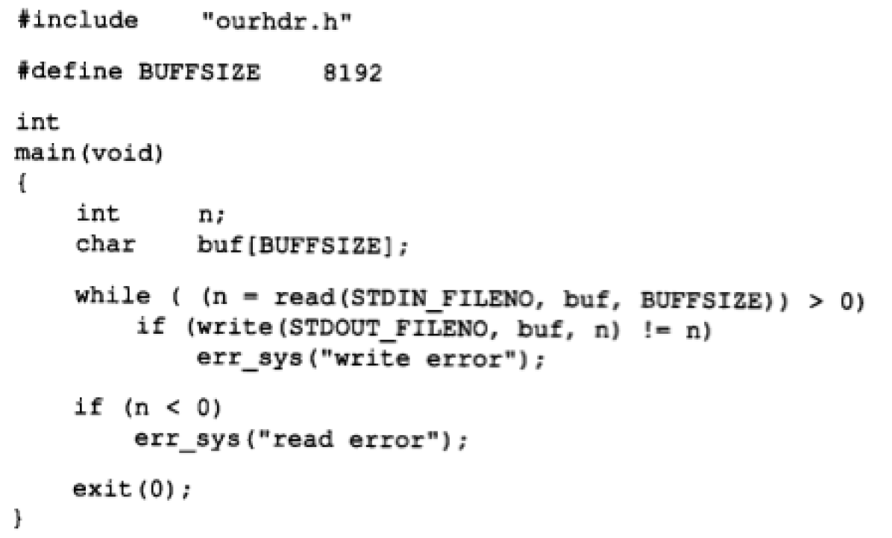
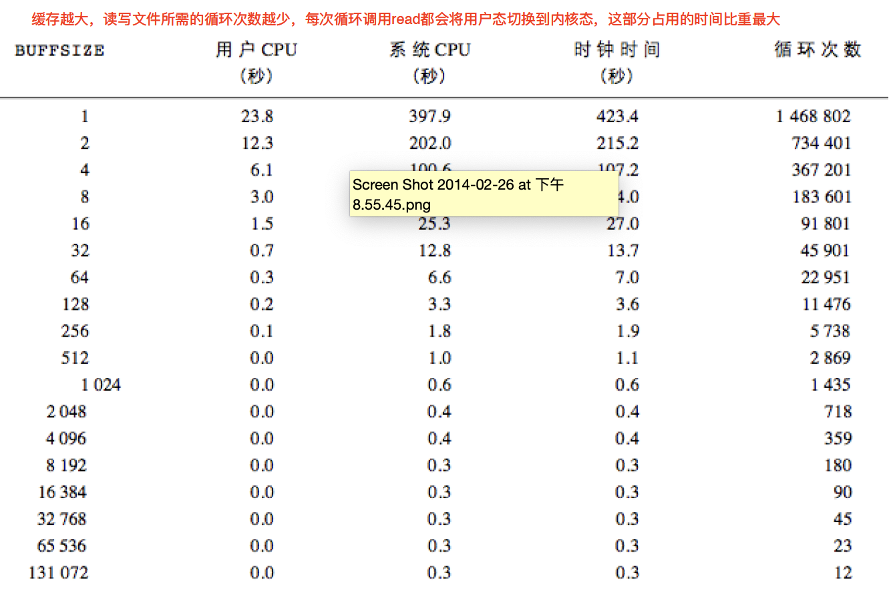
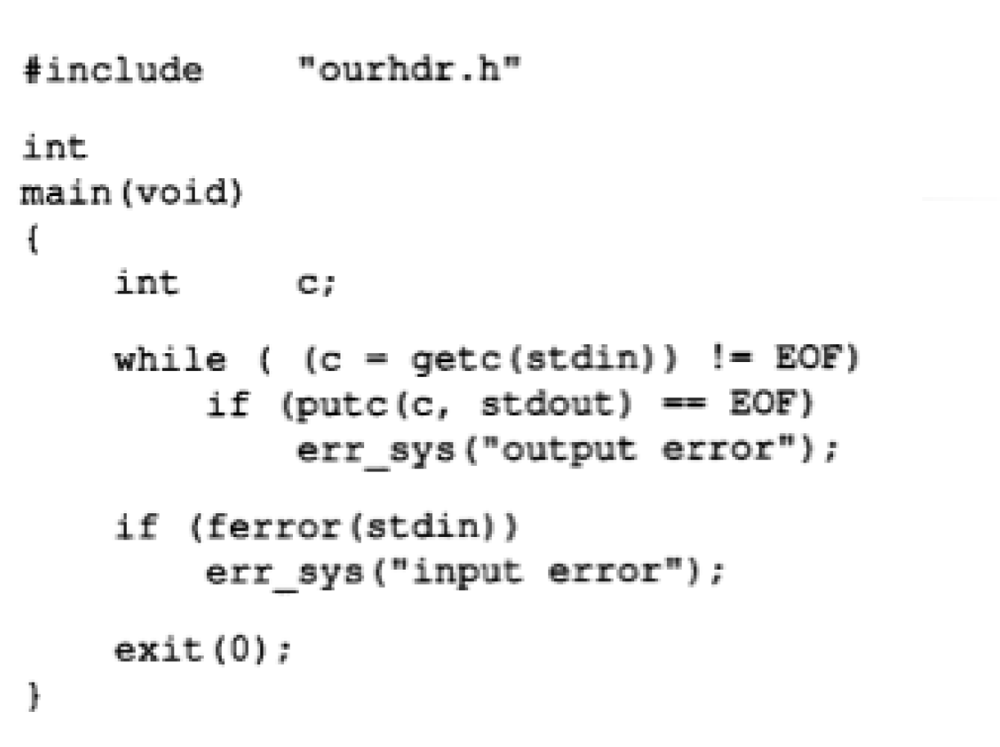
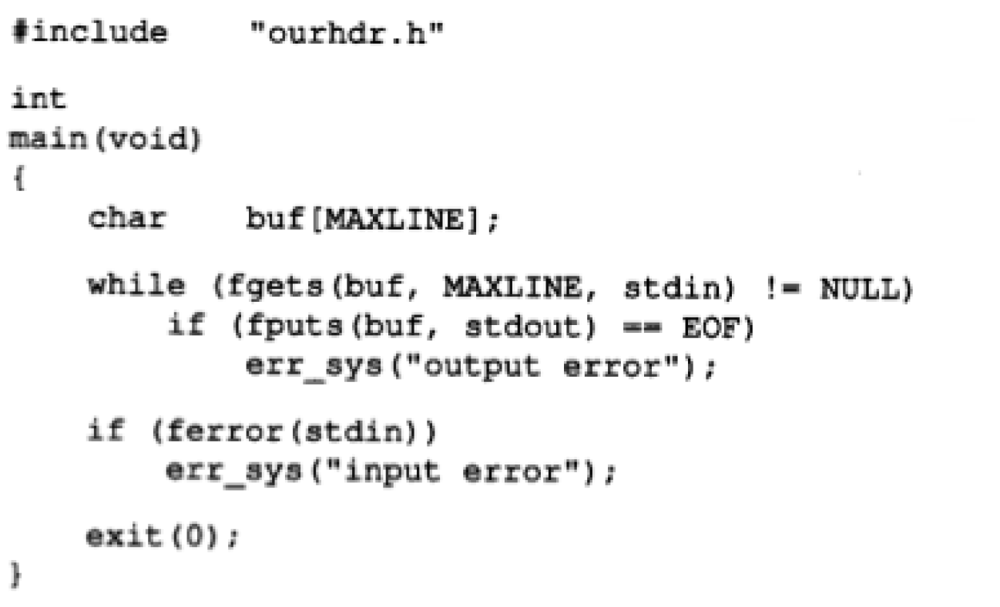
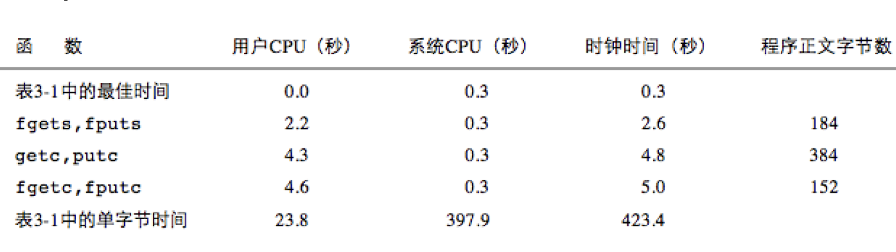

# Linux程序设计--第十课

> By Leonezhurui, Software Engineering


Input of a character

* getc, fgetc, getchar functions

```C
#include <stdio.h>
int getc(FILE *fp);
int fgetc(FILE *fp);
int getchar(void);
(Result: Reads the next character from a stream and returns it as an unsigned char cast to an int, or EOFon end of file or error.) 强制类型转换成int
```

* Three functions:
  * ferror, feof, clearerr
* ungetc function: push a character back to a stream.

fgetc和getc的差别：C库并没有说有啥差别。在大部分的实现中，getc是被写成宏的(在编译之前就被替换掉)，而fgetc则被写成函数。

getc会被fgetc快一点；getc更容易出错(由于是宏替换)

函数副作用：

例如square函数

```C
#define sq(x) x*x(语法肯定不是这样)
int a =3;
int b = sq(a++); // 则会出问题
//答案则会变成12
```


ungetc函数：将一个字符放到流中(相当于做一次撤销)


Output of a Character

* putc, fputc, putchar functions

```C
#include <stdio.h>
int putc(int c, FILE *fp);
int fputc(int c, FILE *fp);
int putchar(int c);
(Return: the character if success; -1 if failure) 
```


Input of a Line of String

* fgets, gets functions

```C
#include <stdio.h>
char *fgets(char *s, int size, FILE *stream);
char *gets(char *s); //not recommended.
```

* fgets: reads in at most **size-1**characters from streamand stores them into the buffer pointed by s. **Reading stops after an EOF or a new line**. A **„\0‟**character is stored at the end of the buffer.

最多读size-1个字符，由于最后一个字符得填充`\0`；最多读一行


Output of a Line of String

* fputs, puts functions

```C
#include <stdio.h>
int fputs(const char *s, FILE *stream);
int puts(const char *s);
```


Question: I/O Efficiency

* Rewrite mycat.c
  * read/write version
  * getc/putc version
  * fgetc/fputc version
  * fgets/fputs version


mycat.c
















Binary Stream Input/Output

* fread/fwrite functions

```C
#include <stdio.h>
size_t fread(void *ptr, size_t size, size_t nmemb, FILE *stream);
size fwrite(const void *ptr, size_t size, size_t nmemb, FILE *stream);
(Return: the number of a items successfully read or written.) 
```

* Application:
* Read/write a binary array:

```C
float data[10];
if ( fwrite(&data[2], sizeof(float), 4, fp) != 4 ) 
	err_sys(“fwrite error”);
```

* Read/write a structure

```C
struct {
	short count; long total; char name[NAMESIZE];
}item;

if ( fwrite(&item, sizeof(item), 1, fp) != 1) 
	err_sys(“fwrite error”);
```

