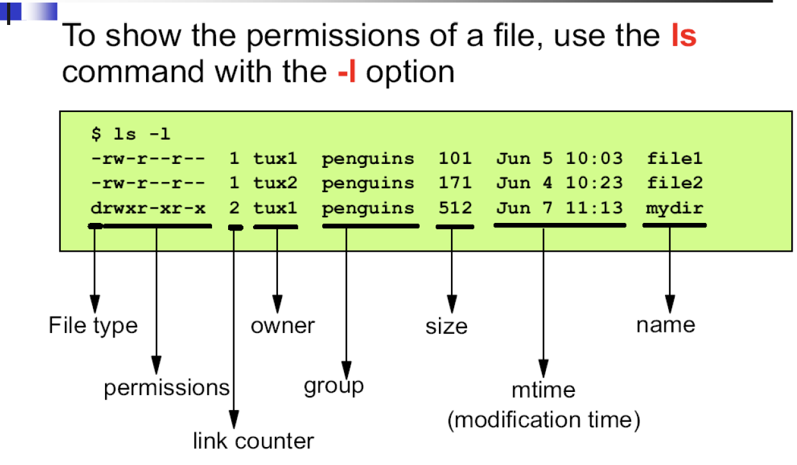
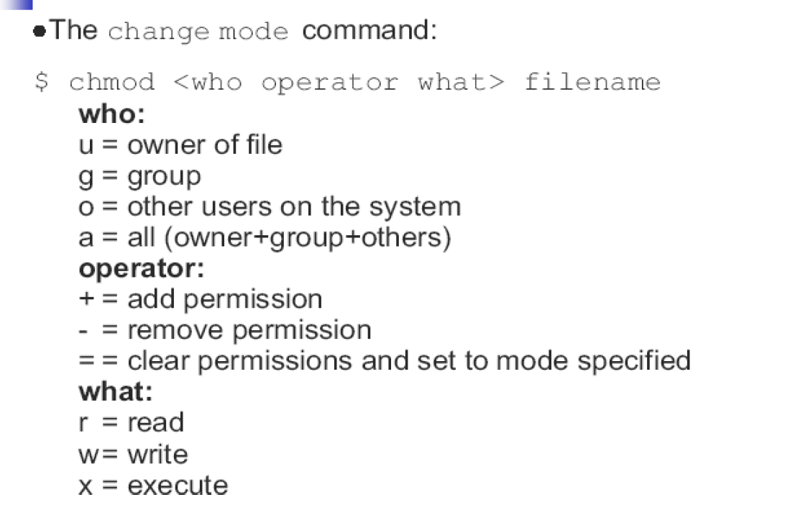
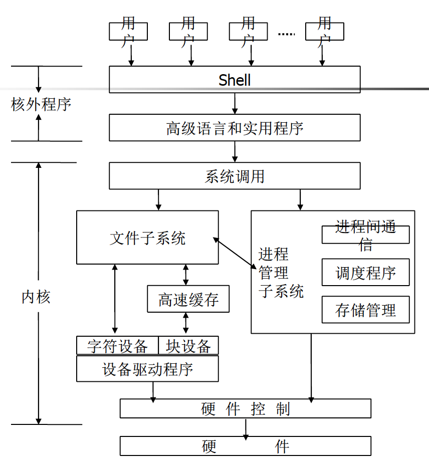
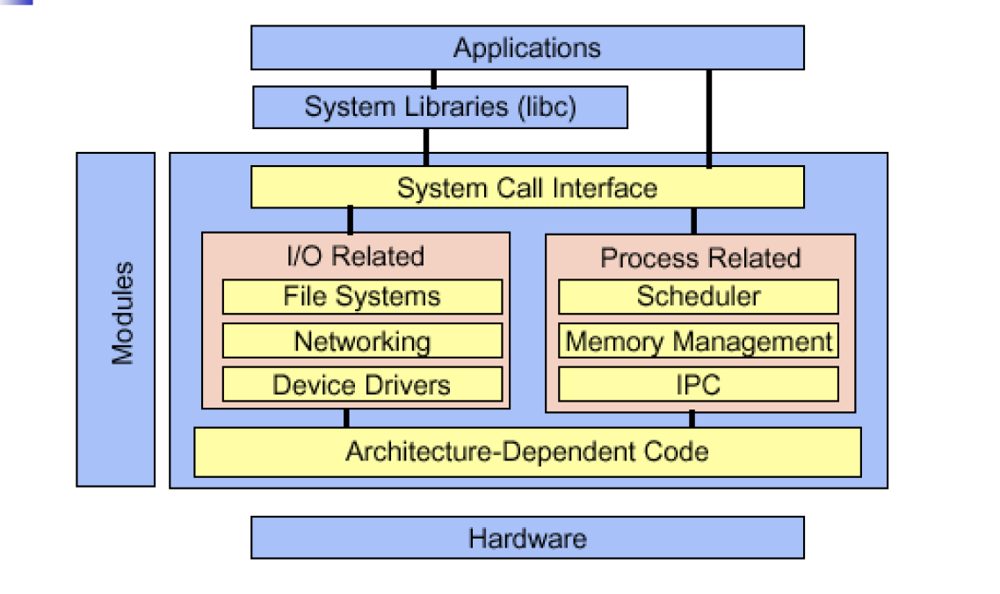

# Linux程序设计--第四课

> By Leonezhurui, Software Engineering


文件权限

查看文件权限：`ls -l`



每一个用户对于文件都有**4个八进制数**


chmod命令




Editing Files

* vi
* emacs
* gedit
* …


Working with Processes

* What is a process?
* A process is a task.
* 进程是一个正在执行的程序实例。由执行程序、它的当前值、状态信息以及通过操作系统管理此进程执行情况的资源组成。
* An address space with one or more threads executing within that address space, and the required system resources for those threads. (susv3)

处理流程

* 什么是进程？
* 进程是一项任务。
* 进程是一个正在执行的程序实例。由执行程序，它的当前值，状态信息以及通过操作系统管理此进程执行情况的资源组成。
* 一个在一个地址空间中执行一个或多个线程的地址空间，以及这些线程所需的系统资源。 （susv3）


* A running program is an example of a process
* A shell is a process that reads your commands and start the appropriate process.
* echo $$


* 正在运行的程序是过程的示例

* Shell是一个读取命令并启动适当过程的过程。
* echo $$


Starting and Stopping a Process

* All processes are started by other processes
* Parent/Child relationship
* One exception: init (PID 1) is started by the kernel itself 
* A tree hierarchy
* A process can be terminated because of two reasons:
* The process terminates itself when done.
* The process is terminated by a signal from another process

开始和停止进程

* 所有进程均由其他进程启动
  * 父母/子女关系
  * 一个例外：init（PID 1）由内核本身启动
  * 树层次结构
* 可以终止进程的原因有两个：
  * 该过程完成后会自行终止。
  * 该进程被另一个进程的信号终止


Basic Commands

* ps: report process status
* pstree: display a tree of processes
* jobs, fg, bg, `<ctrl-z>`: job controlling
* kill: 
* nohup: run a command, ignoring hangup signals
* nice, renice: 
* top: display top CPU processes

bg：后台执行

fg：前台执行


Daemons(守护进程)

linux下专门处理打印机功能


How to Find Help?

* “man” command
* “info”
* command --help
* HOWTO Documentation
* Refer to Internet


The man command

* With the man command you can read the manual page of commands
* Manual pages are stored in /usr/man
* The manual page consists of:
* Name: The name of the command and a online description
* Synopsis: The syntax of the command
* Description: Explanation of how the command works and what it does
* Files: The files used by the command
* Bugs: Known bugs and errors
* See also: Other commands related to this one

man命令

* 使用man命令，您可以阅读命令的手册页
* 手册页存储在/ usr / man中
* 手册页包括：
  * 名称：命令名称和在线说明
  * 简介：命令的语法
  * 说明：该命令的工作方式及其作用的说明
  * 文件：命令使用的文件
  * 错误：已知错误和错误
  * 另请参见：与此命令相关的其他命令


* The “-k” option
* man –k print
* Manual pages are divided in 8 sections:

1. User commands

2. System calls

3. Libc calls

4. Devices

5. File formats and protocols

6. Games

7. Conventions, macro packages and so forth

8. System administation

* To select correct section, add section number
* man 1 passwd, man 5 passwd


UNIX




Programmer’s Viewpoint




基本命令(1)

* 文件操作
  * 列出目录内容: ls, dir, vdir
  * 创建特殊文件: mkdir, mknod, mkfifo
  * 文件操作: cp, mv, rm
  * 修改文件属性: chmod, chown, chgrp, touch
  * 查找文件: locate, find
  * 字符串匹配: grep(egrep)
  * 其它: pwd, cd, ar, file, tar, more, less, head, tail, cat

* 进程操作
  * ps, kill, jobs, fg, bg, nice
* 其它
  * who, whoami, passwd, su, uname, …
  * man


* 重定向
* 标准输入、标准输出、标准错误
  * 对应的文件描述符：0, 1, 2
  * C语言变量：stdin, stdout, stderr
* `<`, ` >`, ` >>`, ` 2>`
  * 例：kill –HUP 1234 > killout.txt 2> killerr.txt
  * 例：kill –HUP 1234 > killout.txt 2>& 1


0号文件描述符是用来读的，1、2号是用来写的

`>>`：文件追加

`>`：文件覆盖

`2>`：错误重定向

```shell
cat < abc.txt

cat 文件名
# 这里的文件名作为cat参数存在
# 类似于C语言中，main(int argc, char** argv)
# 当argc等于0，在system.in中读，再system.out打印
# 当cat后面加上参数，就读出文件内容，输出在屏幕上
# cat < 文件名，这里是重定向
# 执行流程完全不一样，仍然是走else分支
```


```shell
find . -name '*.c' | grep 
```

前面的的结果会一个一个的交给grep命令

==xargs？？？？==

==sed？？？？==(见Linux高级命令学习)


* 管道
* 一个进程的输出作为另一个进程的输入
* 例: 
  * `ls | wc –l`：存在一个管道文件，这个文件作为输入传递给后面的命令
  * ls –lF | grep ^d
  * ar t /usr/lib/libc.a | grep printf | pr -4 -t


* 环境变量
  * 操作环境的参数
  * 查看和设置环境变量
  * echo, env, set
* 例: PATH环境变量
  * `echo $PATH`
  * `/usr/local/bin:/bin:/usr/bin:/usr/X11R6/bin:/home/song/bin`
  * `PATH=$PATH:.`
  * `export PATH`


高级命令与正则表达式

* find
* sed
* `sed 's/\([0-9A-Za-z_]\{1,\}\)\[ \{0,\}\]\[ \{0,\}\]/*\1\[\]/g' code1.cpp`
* grep


