# Linux系统调用之I/O操作

> By Leonezhurui, Software Engineering


## 文件和文件描述符

### 文件

在 Linux 的世界里，一切设备皆文件。我们可以系统调用中 I/O 的函数（I：input，输入；O：output，输出），对文件进行相应的操作（ **open()、close()、write() 、read()** 等）。


### 文件描述符

**打开现存文件或新建文件**时，系统（内核）会返回一个文件描述符，文件描述符用来指定已打开的文件。这个文件描述符相当于这个已打开文件的标号，文件描述符是非负整数，是**文件的标识，操作这个文件描述符相当于操作这个描述符所指定的文件**。


程序运行起来后（**每个进程）都有一张文件描述符的表**，标准输入、标准输出、标准错误输出设备文件被打开，对应的文件描述符 0、1、2 记录在表中。程序运行起来后这三个文件描述符是**默认打开**的:

```C
 #define STDIN_FILENO  0 //标准输入的文件描述符
 #define STDOUT_FILENO 1 //标准输出的文件描述符
 #define STDERR_FILENO 2 //标准错误的文件描述符上面3个常量定义在`/usr/include/unistd.h`中。
```

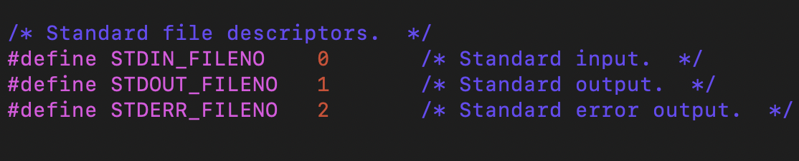


在程序运行起来后打开其他文件时，系统会**返回文件描述符表中最小可用的文件描述符**，并将此文件描述符记录在表中。Linux 中一个进程最多只能打开 **NR_OPEN_DEFAULT** （即1024）个文件，故**当文件不再使用时应及时调用 close() 函数关闭文件**。


## 常见的I/O函数

需要的头文件：

```csharp
#include <sys/types.h>
#include <sys/stat.h>
#include <fcntl.h>
#include <unistd.h>
```


### open函数

```C
int open(const char *pathname, int flags, mode_t mode);
```

功能：

打开文件，**如果文件不存在则创建**。


参数：

**pathname**: **文件的路径及文件名**。

**flags**: 打开文件的行为标志，如，以只读方式（O_RDONLY，第一个为字母不是零）打开，以读写或新建新文件的方式（O_RDWR|O_CREAT）打开。

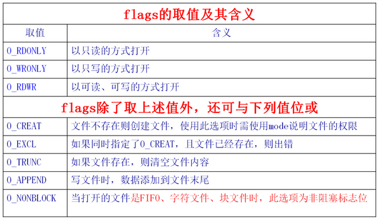

**mode**: 这个参数，只有在文件不存在时有效，指新建文件时指定文件的权限。

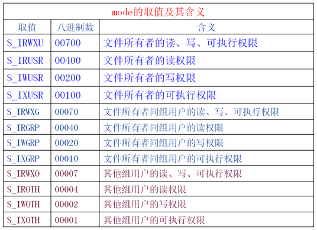

**返回值**：

* 成功：成功返回打开的文件描述符

* 失败：-1


### close函数

```C
int close(int fd);
```

功能：

关闭已打开的文件

参数：

fd: 文件描述符，open()的返回值

返回值：

成功：0

失败：-1


### write函数

```C
ssize_t write(int fd, const void *addr, size_t count);
```

功能：

**把指定数目的数据写到文件（fd）**

参数：

* fd: 文件描述符

* addr: **数据首地址**

* count: 写入数据的长度（字节），一般情况下，数据有多少，就往文件里写多少，不能多也不能少

 返回值：

* 成功：**实际写入数据的字节个数**

* 失败：-1
  
  


### read函数

```C
ssize_t read(int fd, void *addr, size_t count);
```

功能：

把指定数目的数据读到内存（缓冲区）

参数：

* fd: 文件描述符

* addr: 内存首地址

* count: 读取的字节个数

返回值：

* 成功：实际读取到的字节个数

* 失败：-1
  
  


### 实战

使用Linux系统调用实现系统命令cp。。。

mycopy.c源码

```C
#include <sys/types.h>
#include <sys/stat.h>
#include <fcntl.h>
#include <unistd.h>
#include <stdio.h>
#include <string.h>

int main(int argc, char* argv[]){
        if(argc != 3 || (strcmp(argv[1], argv[2])==0)){
                perror("parameter error!");
                return -1;
        }
        else{
                int fd1 = open(argv[1], O_RDONLY);
                if(fd1 < 0){
                        perror("argv[1] error!");
                        return -1;
                }
                int fd2 = open(argv[2], O_WRONLY|O_CREAT, 0755);
                if(fd2 < 0){
                        perror("argv[2] error!");
                        return -1;
                }

                int len;
                do{
                        char buf[1024];
                        len = read(fd1, buf, sizeof(buf));
                        write(fd2, buf, len);
                }while(len > 0);
                close(fd1);
                close(fd2);
                return 0;
        }

}
```

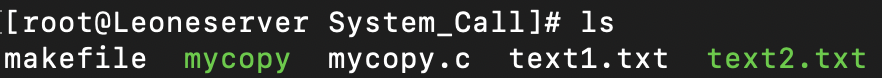

makefile源码

```makefile
CC:=gcc
OBJECT:=mycopy
SOURCE:=mycopy.c
all:
        $(CC) -o $(OBJECT) $(SOURCE)
clean:
        rm -rf $(OBJECT)
```


## lseek函数

所有大家的文件都有一个**当前文件偏移量**(current file offset)，cfo通常是一个非负整数，**用于表明文件开始处到文件当前位置的字节数**。

读写操作通常开始于 cfo，并且使 cfo 增大，**增量为读写的字节数**。文件被打开时，cfo 会被初始化为 0，除非使用了**O_APPEND**(数据添加到文件末尾)。


使用 lseek 函数可以改变文件的 cfo 。

```C
#include <unistd.h>
#include <sys/types.h>
off_t lseek(int fd, off_t offset, int whence);
```

返回值：新的偏移量（成功），-1（失败）


参数 offset 的含义取决于参数 whence：

1. 如果 whence 是 **SEEK_SET**，**文件偏移量将被设置为 offset**。(可以理解为将位置调到文件起始位置)
2. 如果 whence 是 **SEEK_CUR**，**文件偏移量将被设置为 cfo 加上 offset**，offset 可以为正也可以为负。(可以理解为将位置调到文件当前读写位置)
3. 如果 whence 是 **SEEK_END**，**文件偏移量将被设置为文件长度加上 offset**，offset 可以为正也可以为负。(可以理解为将位置调到文件末尾位置)


lseek 的以下用法返回当前的偏移量：

```C
off_t  currpos;
currpos = lseek(fd, 0, SEEK_CUR);
```

lseek 的以下用法返回文件长度：

```C
off_t  currpos;
currpos = lseek(fd, 0, SEEK_END);
```


### 实战

使用lseek读取当前文件偏移，读取文件长度；并验证read/write时是从当前文件偏移处开始的。

```C
#include <sys/types.h>
#include <sys/stat.h>
#include <fcntl.h>
#include <unistd.h>
#include <stdio.h>
#include <string.h>

int main(int argc, char* argv[]){
        int fd, ret, len, ret1;

        fd = open(argv[1], O_RDONLY);

        ret = lseek(fd, 0, SEEK_CUR);
        len = lseek(fd, 0, SEEK_END);
        printf("File %s length: %d.\n", argv[1], len);
        printf("Current file offset: %d \n", ret);

        ret=lseek(fd, 0, SEEK_CUR);
        printf("Current file offset: %d \n", ret);
        ret=lseek(fd, 0, SEEK_SET);
        printf("Current file offset: %d \n \n", ret);

        printf("Now read file!\n");

        ret1 = lseek(fd, 10, SEEK_CUR);
        printf("Current file offset: %d \n", ret1);

        char buf[1024]={0};
        read(fd, buf, sizeof(buf));
        printf("Buffer Content:\n %s", buf);

        return 0;
}
```


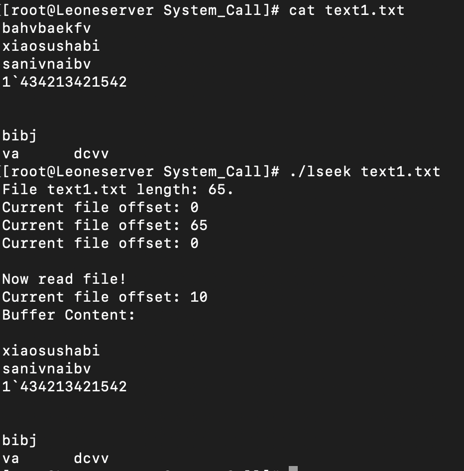


## dup/dup2函数

### dup函数

```C
#include <unistd.h>
int dup(int oldfd);
```

dup用来复制参数oldfd所指的文件描述符。复制成功时，**返回最小的尚未被使用过的文件描述符**，若有错误则返回-1。

返回的新文件描述符和参数oldfd**指向同一个文件**，这两个描述符共享同一个数据结构，共享所有的锁定、读写指针和各项权限或标志位


调用dup(oldfd)等效于 

```C
fcntl(oldfd, F_DUPFD, 0)
```


### dup2函数

```C
 #include <unistd.h>
 int dup2(int oldfd, int newfd);
```

`dup2`与`dup`区别是**`dup2`可以用参数`newfd`指定新文件描述符的数值**。

若参数`newfd`已经被程序使用，则系统就会将`newfd`所指的文件关闭。若`newfd`等于`oldfd`，则返回`newfd`，而不关闭`newfd`所指的文件。

`dup2`所复制的文件描述符与原来的文件描述符共享各种文件状态。共享所有的锁定，读写位置和各项权限或`flags`等。


dup2(oldfd, newfd)等效于 

```C
close(oldfd)； 
fcntl(oldfd, F_DUPFD, newfd)； 
```

在shell的重定向功能中，(输入重定向”<”和输出重定向”>”)就是通过调用dup或dup2函数对标准输入和标准输出的操作来实现的。


### 实战

这里使用`text.txt`文件描述符赋值给标准输出文件描述符，则标准输出的所有部分都将写到`text.txt`文件中；也就是1号文件描述符所指向的文件就是`text.txt`，已经不再是原来的标准输出。

```C
#include <fcntl.h>
#include <unistd.h>
#include <stdio.h>
#include <string.h>

int main(int argc, char* argv[]){
        int oldfd, newfd;
        if((oldfd=open("text.txt", O_CREAT|O_RDWR, 0644))==-1){
                printf("open error\n");
                return -1;
        }

        newfd = dup2(oldfd, fileno(stdout)); //这里的fileno(stdout)可以替换成STDOUT_FILENO，这里是预定义在/usr/include/unistd.h头文件中的。
        printf("Newfd: %d\n", newfd);

        char* buf = "Sutaorui 421!\n";

        if(write(fileno(stdout), buf, strlen(buf)) < strlen(buf)){
                printf("write error\n");
                return -1;
        }
        return 0;
}
```


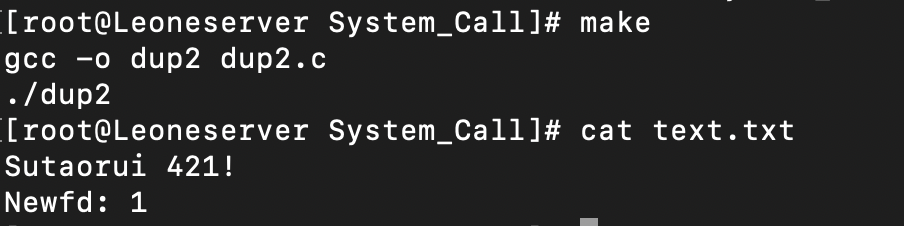


## fcntl函数

fcntl系统调用可以用来**对已打开的文件描述符进行各种控制操作以改变已打开文件的的各种属性**。

```C
#include<unistd.h>
#include<fcntl.h>
int fcntl(int fd, int cmd);
int fcntl(int fd, int cmd, long arg);
int fcntl(int fd, int cmd ,struct flock* lock);
```


fcntl函数功能依据cmd的值的不同而不同。参数对应功能如下：

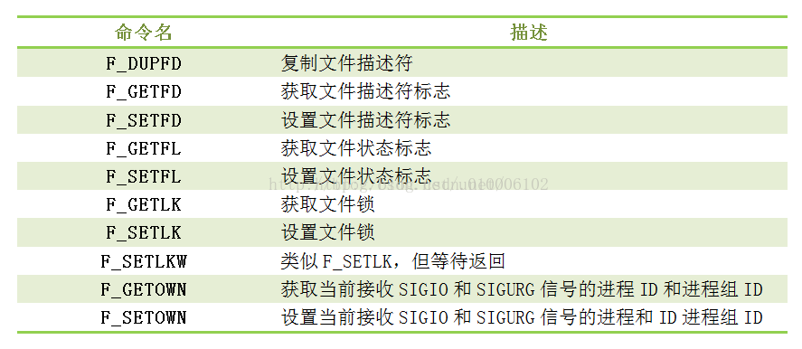

1. F_DUPFD

   与dup函数功能一样，**复制由fd指向的文件描述符**，调用成功后返回新的文件描述符，与旧的文件描述符共同指向同一个文件。

2. F_GETFD

   读取文件描述符**close-on-exec标志**

3. F_SETFD

   将文件描述符close-on-exec标志设置为第三个参数arg的最后一位

4. F_GETFL

   获取文件打开方式的标志，标志值含义与open调用一致

5. F_SETF

   设置文件打开方式为arg指定方式


## fork()函数

一个进程，包括**代码、数据和分配给进程的资源**。fork()函数通过**系统调用创建一个与原来进程几乎完全相同的进程**，也就是两个进程可以做完全相同的事，但如果初始参数或者传入的变量不同，两个进程也可以做不同的事。
 一个进程调用fork()函数后，**系统先给新的进程分配资源，例如存储数据和代码的空间。然后把原来的进程的所有值都复制到新的新进程中，只有少数值与原来的进程的值不同。相当于克隆了一个自己。**


在语句`fpid=fork()`之前，只有一个进程在执行这段代码，但在这条语句之后，就变成两个进程在执行了，这两个进程的几乎完全相同，将要执行的下一条语句都是if(fpid<0)……

 为什么两个进程的fpid不同呢，这与fork函数的特性有关。fork调用的一个奇妙之处就是它**仅仅被调用一次，却能够返回两次**，它可能有三种不同的返回值：

1. 在父进程中，fork返回新创建子进程的进程ID；
2. 在子进程中，fork返回0；
3. 如果出现错误，fork返回一个负值；

在fork函数执行完毕后，如果创建新进程成功，则出现两个进程，一个是子进程，一个是父进程。**在子进程中，fork函数返回0，在父进程中，fork返回新创建子进程的进程ID**。我们可以**通过fork返回的值来判断当前进程是子进程还是父进程**。

引用一位网友的话来解释**fpid的值(fork返回值)为什么在父子进程中不同**。“其实就相当于链表，**进程形成了链表，父进程的fpid(p 意味point)指向子进程的进程id, 因为子进程没有子进程，所以其fpid为0**。

创建新进程成功后，**系统中出现两个基本完全相同的进程，这两个进程执行没有固定的先后顺序，哪个进程先执行要看系统的进程调度策略**。

每个进程都有一个**独特（互不相同）的进程标识符**（process ID），可以通过getpid（）函数获得，还有一个记录父进程pid的变量，可以通过getppid（）函数获得变量的值。


### 实战

编写一个小程序，来体会一下fork函数。

```C
#include <unistd.h>
#include <stdio.h>

int main(int argc, char* argv[]){
        pid_t fpid;
        int count=0;
        fpid = fork();
        if(fpid < 0){
                printf("fork error!\n");
        }else if(fpid == 0){
                printf("I'm Su TaoRui! Pid: %d.\n", getpid());
                count++;
        }else{
                printf("I'm Su's Father! Pid: %d.\n", getpid());
                count++;
        }
        printf("Total number of Process is %d.\n", count);
        return 0;

}
```

运行结果如下：

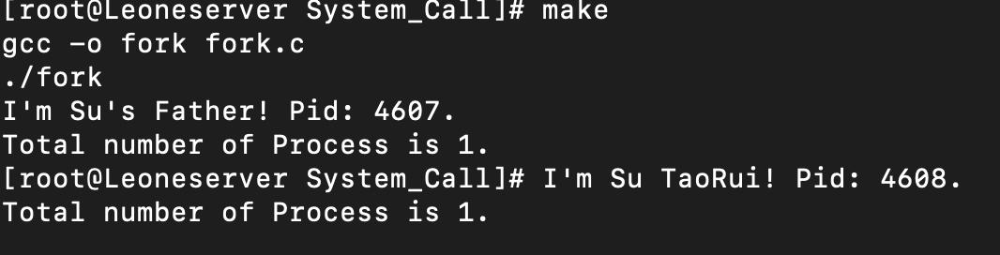


## execl函数

```C
//Linux下头文件
#include <unistd.h>
//函数定义
int execl(const char *path, const char *arg, ...);
```

**函数说明：**

execl()其中**后缀"l"代表list也就是参数列表的意思**，第一参数**path字符指针所指向要执行的文件路径**， 接下来的参数代表执行该文件时传递的参数列表：argv[0], argv[1]... **最后一个参数须用空指针NULL作结束**。

**函数返回值：**

成功则不返回值， 失败返回-1， 失败原因存于errno中，可通过perror()打印

**execl函数特点:**

当进程调用一种exec函数时，**该进程完全由新程序代换**，而新程序则从其main函数开始执行。因为调用exec并不创建新进程，所以前后的进程ID并未改变。**exec只是用另一个新程序替换了当前进程的正文、数据、堆和栈段**。

用另一个新程序替换了当前进程的正文、数据、堆和栈段。当前进程的正文都被替换了，那么execl后的语句，即便execl退出了，都不会被执行。


### 实战

```C
#include <unistd.h>
#include <stdio.h>

int main(int argc, char* argv[]){
        printf("Test Start!\n");
        execl("/bin/ls", "ls", NULL);
        printf("Su is my Son! Exists?\n");

}
```


运行结果如下：

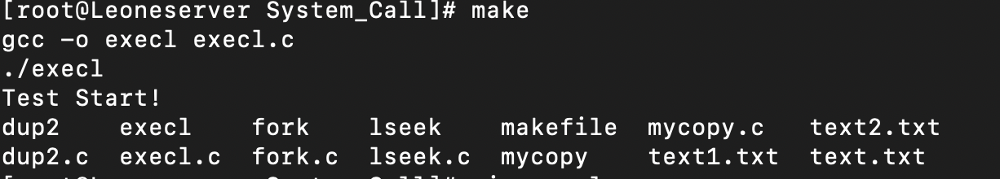


注意：

1. execl的第一个参数是命令所在的文件路径，后面的参数是命令和其参数，最后需要使用`NULL`结束。
2. 原进程被新进程替换，execl后面的程序将不会执行。


## fork和execl课堂实战

==这个实战存在问题！！！==

forkExecl

```C
#include <unistd.h>
#include <stdio.h>
#include <sys/types.h>
#include <sys/stat.h>
#include <fcntl.h>
#include <string.h>

int main(int argc, char* argv[]){
        pid_t fpid;
        int fd = open("text1.txt", O_RDWR|O_APPEND);
        if(fd == -1){
                printf("open error!\n");
        }

        printf("fd = %d.\n", fd);
        printf("fork()!\n");

        fcntl(fd, F_SETFD, 1);
        char* s = "I'm Su TaoRui's Father!\n";
        fpid = fork();
        if(fpid == 0){
                execl("/home/sh/System_call", "./ass", &fd, NULL);
        }
        wait(NULL); //等待僵尸进程消亡掉！(就是这里的子进程)
        write(fd, s, strlen(s));
        close(fd);
        return 0;
}
```


ass.c

```C
#include <sys/types.h>
#include <sys/stat.h>
#include <fcntl.h>
#include <unistd.h>
#include <string.h>
#include <stdio.h>

int main(int argc, char* argv[]){
        int fd = *argv[1];
        printf("fd = %d.\n", fd);
        char* s = "Su is shabai!";

        write(fd, s, strlen(s));
        close(fd);
        return 0;
}
```


运行结果如下：

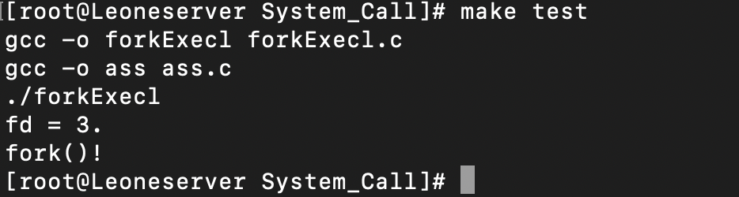

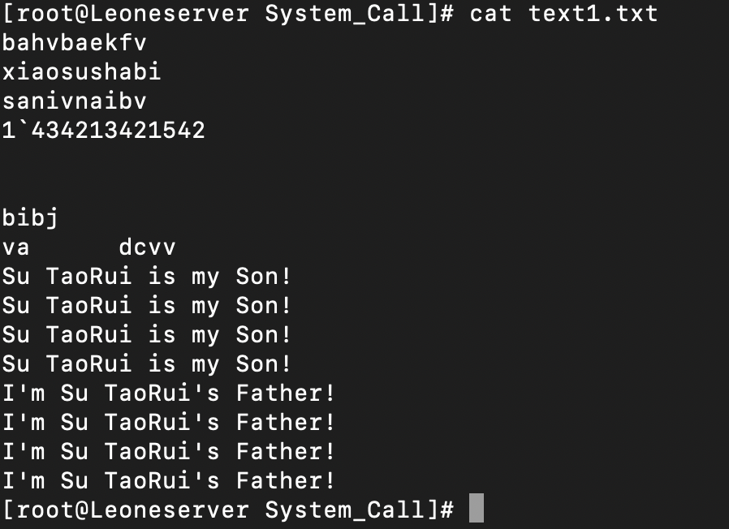

注意上面text1.txt文件中，它会重复写两次`char* s`的内容？？？

