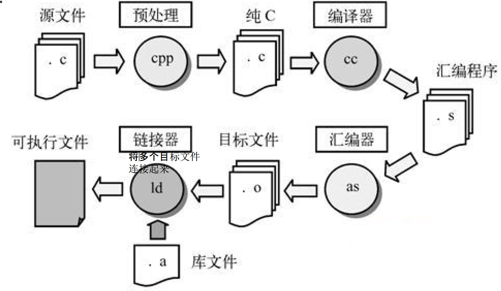
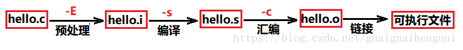

# 编译链接学习

> By Leonezhurui, Software Engineering

程序要运行起来，必须要经过四个步骤：预处理、编译、汇编和链接。

使用 gcc 命令不跟任何的选项的话，会默认执行预处理、编译、汇编、链接这整个过程。

* `-E`选项：提示编译器执行完预处理就停下来，后边的编译、汇编、链接就先不执行了。

* `-S`选项：提示编译器执行完编译就停下来，不去执行汇编和链接了。

* `-c`选项：提示编译器执行完汇编就停下来。

所以，这三个选项相当于是限定了编译器执行操作的停止时间，而不是单独的将某一步拎出来执行。

## 预处理

使用**-E**选项，表示只进行预编译，对应**生成一个 .i 文件**。

预处理过程进行的操作：

* 将所有的“#define”删除，并且展开所有的宏定义
* 处理所有的条件编译指令，比如“#if”、“#ifdef”、“#elif”、“#else”、“#endif”
* 处理“#include”预编译指令，将被包含的头文件插入到该编译指令的位置。（这个过程是递归进行的，因为被包含的文件可能还包含了其他文件）
* 删除所有的注释“//”和“/* */”。
* 添加行号和文件名标识，方便后边编译时编译器产生调试用的行号信息以及编译时产生编译错误或警告时能够显示行号。
* 保留所有的#pragma编译指令，因为编译器需要使用它们。

## 编译

使用**-S**选项，表示编译操作执行完就结束。对应**生成一个 .s 文件**。

编译过程是整个程序构建的核心部分，编译成功，会将源代码由文本形式转换成机器语言，编译过程就是把预处理完的文件进行一系列词法分析、语法分析、语义分析以及优化后生成相应的汇编代码文件。

编译过程

* 词法分析

* 语法分析

* 语义分析

* 中间代码生成

- 目标代码生成与优化

## 汇编

汇编过程调用**汇编器as**来完成，是用于将汇编代码转换成机器可以执行的指令，每一个汇编语句几乎都对应一条机器指令。

使用命令as hello.s -o hello.o 或者使用gcc -c hello.s -o hello.o来执行到汇编过程结束，对应生成的文件是.o文件。

## 链接

链接的主要内容就是**将各个模块之间相互引用的部分正确的衔接起来**。它的工作就是把一些指令对其他符号地址的引用加以修正。链接过程主要包括了地址和空间分配、符号决议和重定向

